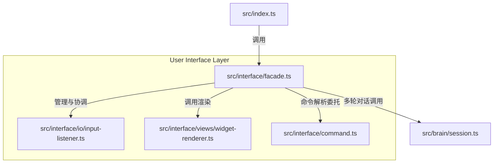

## 背景

当前的终端界面交互层全部集中在 `src/interface/cli.ts` 中，文件大小约 16KB，长度达 424 行。这导致了三个核心职责的强耦合：
1. **输入与生命周期控制**：强依赖 `readline` 模块监听终端键盘按键（包含捕获 `Ctrl+C`、双击 `ESC` 触发 `session.abort` 或历史回滚）以进行 `REPL` 输入流控。
2. **命令路由与分发**：集成了交互式菜单 `showInteractiveMenu` 以及 `/` 路由逻辑分发，直接在输入捕获中嵌套斜杠命令的条件路由。
3. **终端视图彩化渲染**：在模块内通过 `console.log` 手写 ANSI 色彩逃逸符，用于输出历史重绘 `redrawHistory`、标签折叠卡片渲染 `renderContentWithWidgets` 以及 Token 监控面板的输出。

这种杂糅结构降低了各模块的职责正交性，极其不利于对输入输出的流程进行独立 Mock 或单元测试，同时也使得界面交互很难在后续进行功能演进。

## 目标与非目标

**目标:**
- **职责彻底剥离**：将终端输入（Read）、逻辑路由（Route）与终端渲染（Write）解耦，提取出独立的子组件并使用门面模式整合。
- **引入门面模式**：引入 `CliFacade` 作为顶层调度，管理各组件的生命周期；保留原有的 `startCli` 导出入口，让启动脚本 `src/index.ts` 能够无缝兼容集成。
- **键盘监听收拢**：将双击 `ESC` 快捷键、`Ctrl+C` 中断等全局按键监听逻辑统一收拢在输入捕获端，向外发出纯净的回调信号。
- **渲染逻辑解耦**：将所有卡片折叠、彩化排版、历史重绘与面板渲染等输出细节，交由独立的 `WidgetRenderer` 进行无状态渲染。

**非目标:**
- 不引入除了既有的 `@clack/prompts` 与 Node.js 原生 `readline` 之外的任何第三方终端界面框架（如 `Inquirer` 或 `Blessed`）。
- 不改变大脑层 `SessionManager` 及底座中任何多轮推理、哈希指纹、Token 计费的核心商业逻辑。
- 不修改原有的 CLI 的交互行为、斜杠命令语法规则和整体界面输出视觉风格。

## 架构决策

为了彻底将输入输出与生命周期从一团乱麻中解放出来，我们采用以下架构分层解耦：

1. **终端输入监听器 (InputListener)**：
   - 物理文件：`src/interface/io/input-listener.ts`
   - 职责：专门负责 `readline.Interface` 实例的创建、销毁和输入捕获。通过 `readline` 的原生自动补全（completer）支持斜杠命令补全。
   - 快捷键集成：监听 `stdin` 的 `keypress`，并在双击 `ESC` 时通过事件或回调触发。若在生成状态中，则抛出 `abort` 中断请求；若在非生成状态，则弹出确认撤销的询问。

2. **视图微件渲染器 (WidgetRenderer)**：
   - 物理文件：`src/interface/views/widget-renderer.ts`
   - 职责：作为无状态的纯展示模块，提供 `renderContentWithWidgets` 过滤定界符并渲染折叠微件；提供 `redrawHistory` 重新回显历史；提供 `renderTokenPanel` 渲染格式化监控面板。

3. **命令路由分发器 (Dispatcher)**：
   - 物理文件：`src/interface/command.ts`
   - 职责：保留原有的 `/` 路由逻辑分发并精纯化。当需要调起 `@clack/prompts` 进行交互菜单（如切换模型、选择技能）时，必须通知门面挂起输入流句柄。

4. **门面协调器 (CliFacade)**：
   - 物理文件：`src/interface/facade.ts`
   - 职责：作为界面层的主控制器。
   - **交互控制权转交**：由于 `@clack/prompts` 在渲染菜单时需要独占 `process.stdin`，而 `InputListener` 的 `readline` 也在监听该流。为防止冲突，当 `CliFacade` 监测到斜杠命令或触发菜单时，会主动调用 `InputListener.pause()` 挂起输入，在菜单关闭或命令执行完毕后，调用 `InputListener.resume()` 重新唤醒并触发 `rl.prompt()`。这彻底消除了原 `cli.ts` 内部频繁 close/re-init 的混乱。

## 风险与权衡

- **输入流抢占导致卡死/乱码** -> 如果在交互菜单弹出时未挂起 `readline` 实例，会导致用户按键被两个模块同时消费，造成屏幕错乱。
  * *缓解策略*：在 `InputListener` 中提供清晰的 `pause()` 与 `resume()` API，控制底层 `readline` 的 `pause`/`resume` 和输入事件监听器的暂时移除，确保同一时刻只有唯一组件独占控制台输入焦点。
- **快捷键回调中的状态冲突** -> 双击 `ESC` 需要知道当前的生成状态 `isGenerating` 才能做出不同判断，这会产生组件间的数据穿透。
  * *缓解策略*：在实例化 `InputListener` 时，以 getter 函数或只读状态引用形式将当前门面的 `isGenerating` 状态注入其中，实现响应式状态查询。
