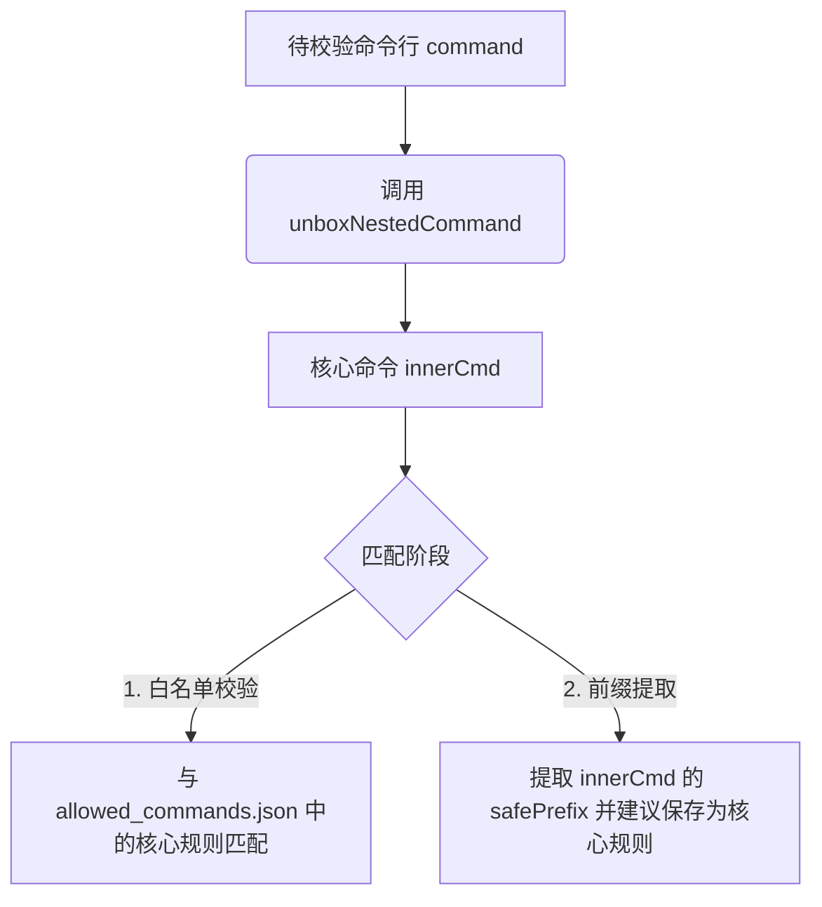

# 探索主题: 基于命令解包剥壳（Unbox）的安全校验与规则放行机制

## 1. 背景与核心冲突

在上一阶段的探索中，我们明确了终端命令安全拦截的两个关键痛点：
1. 代码中硬编码的 `READONLY_COMMAND_WHITELIST` 绕过了审批，存在越界信息泄漏和 Hook 副作用风险；
2. 在 Windows 环境下，Agent 天然倾向于使用 `powershell` 或 `cmd` 包裹执行命令，导致前缀匹配机制（如 `powershell Get-ChildItem`）无法有效积累白名单规则。

然而，上一版方案中提出的“拒绝为解释器前缀生成规则 + 强行引导 Agent 避开包装”在实际工程中存在以下严重技术瓶颈：
- **Windows 的 `spawn(shell: false)` 兼容性屏障**：
  在 [terminal-engine.ts](file:///d:/Projects/MyAgent/src/adapters/tools/tools/system/terminal-engine.ts#L414) 中，引擎以 `shell: false` 启动子进程。如果 Agent 试图执行不带解释器壳的原生 Windows CMD 命令（如 `dir`）或一些 `.cmd` / `.bat` 脚本（如 `vitest`），会直接报 `ENOENT` 错误（找不到文件）。
- **用户摩擦力的爆发**：
  如果通用解释器前缀命令由于安全原因彻底不能保存为前缀规则，在 Windows 复杂环境下，用户将面临“每执行一次 powershell 包装命令就要弹窗确认一次”的极差体验。

---

## 2. 改进方案：“解包剥壳校验 (Unbox & Verify)”机制

为了在“不给 powershell 全局放行”与“避免频繁弹窗且保证 Windows 兼容性”之间取得完美平衡，我们提出了基于 [unboxNestedCommand](file:///d:/Projects/MyAgent/src/adapters/tools/tools/system/terminal-guard.ts#L128) 的“解包剥壳校验”机制。

### 核心处理逻辑

在整个安全拦截和白名单生命周期中，对待校验命令一律实行“先解包剥壳，再进行核心校验”：



### 1) 允许命令白名单提取（`extractSafePrefix` 阶段）
在 [terminal-config.ts](file:///d:/Projects/MyAgent/src/adapters/tools/tools/system/terminal-config.ts#L176) 的 `extractSafePrefix` 中，先对命令进行剥壳，获取核心命令后再提取安全前缀：
```typescript
export function extractSafePrefix(command: string): string | null {
  // 1. 剥离 powershell / cmd / bash 等包装壳，提取出实际的子命令
  const unboxed = unboxNestedCommand(command);
  
  // 2. 对核心命令提取前缀
  const parts = unboxed.trim().split(/\s+/);
  if (parts.length < 2) {
    return null;
  }
  const root = parts[0];
  const sub = parts[1];
  
  const subRegex = /^[a-zA-Z0-9]+$/;
  if (subRegex.test(sub)) {
    return `${root} ${sub}`;
  }
  return null;
}
```
*效果*：执行 `powershell -Command "npm run test"` 时，提取出的 safePrefix 为 `npm run`。系统会建议用户持久化 `npm run:*`，而非危险的 `powershell:*`。

### 2) 安全审查白名单匹配（`checkSafety` 阶段）
在 [terminal.ts](file:///d:/Projects/MyAgent/src/adapters/tools/tools/system/terminal.ts#L98) 的安全检测中，对待执行的命令同样先剥壳，再与白名单规则匹配：
```typescript
    // 4. Auto 模式且属于只读白名单级别指令，进行已授权白名单的前缀校验
    const safetyLevel = checkCommandSafetyLevel(command);
    if (safetyLevel === 'allow' && workMode === 'Auto') {
      const allowed = sessionContext ? sessionContext.getSecurityAllowlist() : [];
      // 关键改动：剥壳后匹配
      const unboxed = unboxNestedCommand(command).trim();
      const isAllowed = allowed.some((rule: string) => {
        if (rule.endsWith(':*')) {
          const prefix = rule.slice(0, -2);
          return unboxed.startsWith(prefix);
        }
        return unboxed === rule;
      });

      if (isAllowed) {
        needApproval = false;
      }
    }
```
*效果*：当用户已授权 `npm run:*` 时，下一次 Agent 发起 `powershell -Command "npm run build"` 将会被解包为 `npm run build`，成功匹配前缀 `npm run:*` 予以静默放行。

### 3) 嵌套包装与复杂参数的边界优化设计（`unboxNestedCommand` 优化）
为了防止复杂的命令行参数（例如 `powershell -ExecutionPolicy Bypass -Command "..."`）导致正则解包失败或由于内部嵌套引号（例如带有 `--filter='src/**'` 的复杂选项参数）导致提取截断，需要对解包逻辑进行健壮性升级：
* **定位剥壳而非正则截取**：通过正则匹配头部解释器与选项并确定位置，直接提取剩余全部字符串作为内层命令，完全避免因内部嵌套引号被正则捕获组误截断。
* **首尾引号配对性判定**：解决由于 Agent 传入多组引号（例如 `"npm run build" --option "some args"`）时，单纯依赖 `startsWith` 和 `endsWith` 导致的误剥离问题。利用扫描闭合点算法（`getMatchingQuoteIndex`）确保只剥离真正包围整个字符串的同一对引号。
* **消除冗余的环境变量清洗**：将第一次 `stripLeadingEnvAssignments` 移除，统一在 `while` 循环内进行单次状态流转处理。
* **清洗 PowerShell 大括号调用块**：对形如 `& { ... }` 包装的核心命令进行进一步过滤（通过正则确保 `&` 后紧随 `{`，以防误伤普通带花括号选项参数的命令）。
* **转义字符局限性说明**：剥壳器仅在当前职责范围内剥离最外层包装的外壳与外部引号，而不承担复杂的 Shell 转义清洗（例如将 `\"hello\"` 还原为 `hello`）。内部的反斜杠转义字符将予以保留，并交由下游解释器处理。

```typescript
/**
 * 寻找与字符串首位引号成对闭合的未转义引号的索引。
 * 如果找不到或闭合点不在末尾，说明首尾引号并不是包围整个字符串的同一对引号。
 */
function getMatchingQuoteIndex(str: string): number {
  const quote = str[0];
  if (quote !== '"' && quote !== "'" && quote !== '`') {
    return -1;
  }
  let isEscaped = false;
  for (let i = 1; i < str.length; i++) {
    const char = str[i];
    if (isEscaped) {
      isEscaped = false;
      continue;
    }
    if (char === '\\') {
      isEscaped = true;
      continue;
    }
    if (char === quote) {
      return i;
    }
  }
  return -1;
}

export function unboxNestedCommand(command: string): string {
  let current = command.trim();

  // 递归剥离前置前缀 env, sudo, exec
  // 注释说明：env 虽为 Unix 命令，但在 Windows 环境下能有效兼容 Git Bash 等类 Unix 模拟终端环境
  const prefixPattern = /^(env|sudo|exec)\s+/i;
  let changed = true;
  while (changed) {
    changed = false;
    const stripped = stripLeadingEnvAssignments(current);
    if (stripped !== current) {
      current = stripped;
      changed = true;
    }
    
    const match = current.match(prefixPattern);
    if (match) {
      current = current.slice(match[0].length).trim();
      changed = true;
    }
  }

  // 改进后的 shellPrefixPattern：支持解释器后附带可选参数，如 -NoProfile -ExecutionPolicy Bypass，以 -Command/-c//c 结尾
  const shellPrefixPattern = /^(sh|bash|cmd|powershell|pwsh)(?:\s+-[a-zA-Z0-9]+(?:\s+[^\s-]+)?)*\s+(?:-c|-Command|\/c)\s+/i;
  const shellMatch = current.match(shellPrefixPattern);
  if (shellMatch) {
    // 采用位置截取，获取匹配头之后的全部剩余字符串，防止正则捕获组在处理复杂的嵌套引号时发生截断
    let innerCmd = current.slice(shellMatch[0].length).trim();
    
    // 剥离最外层的一对包围引号（通过 getMatchingQuoteIndex 判定是否为同一对包裹引号，防止如 "cmd A" --arg "cmd B" 类型的首尾误判）
    const firstChar = innerCmd[0];
    if (firstChar === '"' || firstChar === "'" || firstChar === '`') {
      const matchIndex = getMatchingQuoteIndex(innerCmd);
      if (matchIndex === innerCmd.length - 1) {
        innerCmd = innerCmd.slice(1, -1).trim();
      }
    }
    
    // 清洗 PowerShell 的 & { ... } 包装（正则确保 & 后紧随 {，防止误伤普通带花括号参数的命令，如 & cmd --config={...}）
    if (/^&\s*\{/.test(innerCmd) && innerCmd.endsWith('}')) {
      innerCmd = innerCmd.replace(/^&\s*\{\s*/, '').replace(/\s*\}$/, '').trim();
    }
    return unboxNestedCommand(innerCmd);
  }

  return current;
}
```

### 4) 融合用户知情告知机制（提升审批透明度）
为了融合“探索一版”关于用户安全教育的设想，在 `suspend` 挂起阶段，如果解包后的实际核心命令与原始命令不一致，审批弹窗提示应当**显式展示“解包后实际核心指令”**，确保用户在知情的前提下进行审批：
```typescript
    if (needApproval) {
      const unboxed = unboxNestedCommand(command);
      const safePrefix = extractSafePrefix(unboxed) ?? undefined;
      
      const displayMessage = unboxed !== command.trim()
        ? `智能体试图在终端执行未授权命令。外壳包装: "${command.trim()}"，实际执行的核心命令为: "${unboxed}"`
        : `智能体试图在终端执行写倾向或未识别命令: "${command}"`;

      return {
        status: 'suspend',
        message: displayMessage,
        safePrefix
      };
    }
```

---

## 3. 竞品分析：Claude Code 终端安全拦截与参数准入体系深度调研

* **系统核心设计** 采用分层纵深防御体系，包含 AST 抽象语法树解析、精细化参数控制白名单、敏感环境变量剥离、运行时环境检测以及特定输入敏感泄露检测等。

* **抽象语法解析** 使用 tree-sitter-bash 库将复杂的 shell 脚本命令转化为 AST 抽象语法树，以此精确识别重定向、进程替换、管道拼接及命令序列，彻底排除利用正则无法防御的复杂逃逸语法。

* **命令精细准入** 提供高度特化且极其严格的只读命令参数白名单（`COMMAND_ALLOWLIST` 和 `CMDLET_ALLOWLIST`），不仅审核基础命令名称，还深入限定至具体 Flag 及其参数值的类型。

* **防止管道绕过** 排除 `xargs` 的 `-i`/`-e` 标志以及 `fd` 的 `-x`/`-X` 等能够代为调用任意子命令的标志，以防 AI 伪造只读行为在子命令内执行高危代码。

* **网络与提权控制** 严格封杀 `Get-WmiObject`、`Get-CimInstance`、`Select-Xml`、`Test-Json` 等 Cmdlet 模块，阻止其通过外部实体解析（ XXE ）或 WMI 网络查询发起出站连接或导致 NTLM 凭据泄漏。

* **隐式代码执行** 剔除 `Get-Command` 与 `Get-Help`，防范通过 PowerShell 的模块自动加载机制（ Module Autoloading ）加载恶意的 `.psm1` 文件，导致静默执行攻击者预埋的初始化脚本。

* **敏感泄露拦截** 实施 `argLeaksValue` 检测，对于 `Write-Output`、`Write-Host` 及 `Start-Sleep` 等指令，强制过滤 any 非 StringConstant 类型的参数（如 `$env:SECRET` ），阻断通过报错机制或日志记录隐式窃取保密数据的行为。

* **剥除外壳机制** 建立 `stripSafeWrappers` 清洗流程，递归剔除命令前缀的无害包装（如 `timeout`、`time`、`nice`、`nohup` ）及安全的局部环境变量（如 `NODE_ENV` ），还原内部真实核心子命令，对齐规则校验。

* **命令防伪绕过** 在处理 `deny` （拒绝）或 `ask` （询问）的安全逻辑中，使用 `stripAllLeadingEnvVars` 拦截机制，无视安全前缀名单，强行剥除一切前导环境变量设置，确保诸如 `FOO=bar denied_cmd` 的绕过企图被精准拦截。

* **白名单前缀降维** 在用户进行白名单规则保存建议时，针对 `BARE_SHELL_PREFIXES` 预定义集合（包含 `sh`、`bash`、`powershell`、`cmd`、`sudo`、`env` 等）强行返回 `null`，绝对禁止用户建立例如 `sudo:*` 或 `powershell:*` 等使安全防御形同虚设 of 超宽泛规则。

---

## 4. 竞品分析：OpenCode 终端安全与权限控制深度调研

* **统一声明校验** 采用双维度的 Action 与 Resource 通配符匹配模型（ `evaluate` 函数 ），在 `bash` 工具中， `action` 固定为 `"bash"`， `resource` 传入待执行的完整命令行文本。

* **持久解耦存储** 引入具体的 `resources` 与持久化模板 `save` 字段分离的设计，在用户批准 "always" 权限时，只将宽泛的 `save` 模板（如带通配符的文件路径 `/**` ）存储到本地 SQLite 数据库中。

* **级联放行机制** 设计了在用户同意“始终允许”一条规则后，自动重新评估当前待处理 Pending 队列的机制，对满足新规的任务予以级联式放行以减少用户点按。

* **极简终端校验** 限制在 V2 开发版本中的 `bash.ts` 实现仅作粗粒度原始命令匹配，没有剥壳清洗逻辑，主要依赖外部工具（如 `LocationMutation` ）来进行外置的工作目录范围拦截。

* **潜在优化负债** 遗留了与旧版架构对齐的技术债，在源码中以 TODO 形式明确指出急需移植 tree-sitter 语法树解析、 PowerShell 命令精简以及参数个数（ BashArity ）分析机制。

---

## 5. 竞品分析：OpenClaw 终端安全与执行防御深度调研

* **三阶段控制流** 将 `system.run` 的生命周期严格拆分为解析（ Parse Phase ）、策略评估（ Policy Phase ）与最终执行（ Execute Phase ）三个隔离阶段，层层设防。

* **时序篡改防御** 在执行瞬时实施 `revalidateApprovedMutableFileOperand` 校验，通过对比审批时生成的脚本文件内容哈希，彻底根除在审批与执行时间差内的脚本代码篡改（ TOC-TOU 漏洞）。

* **目录漂移校验** 引入 `approvedCwdSnapshot` 工作目录快照机制，在进程真正 spawn 启动前重新核验物理路径，防止通过动态变更软链接逃逸出授权工作区。

* **模型自动审计** 提供 `ExecAutoReviewer` 机制，在白名单未命中的情况下，引入微型大模型评估以判定是否 `allow-once` ，在安全可控的前提下显著降低人机交互摩擦。

* **内联求值阻断** 实施 `strictInlineEval` 机制，利用 `inlineEvalHit` 对命令行中试图执行 `eval` 、 `-e` 动态字符串或高危管道拼接的行为进行专项拦截与降级，防范隐藏 of 命令注入。

---

## 6. 竞品分析：Hermes 终端安全与描述级准入深度调研

* **描述准入机制** 舍弃了传统的命令前缀匹配，转而采用以“危险类别描述（ `pattern_key` / `description` ）”为维度的白名单管理。一旦放行某种危险类别（如 `"recursive delete"` ），后续所有命中该分类的变体命令均可静默通过。

* **命令去混淆化** 在安全审查前调用 `_normalize_command_for_detection` 对指令进行严苛的规范化预处理，自动剥除 ANSI 转义序列、 null 字节、转义反斜杠（如 `r\m` 还原为 `rm` ）及空引号，彻底阻断利用 shell 语法特性进行的混淆绕过。

* **分级拦截逻辑** 维护两套安全模式，普通危险模式（ `DANGEROUS_PATTERNS` ）触发挂起审批，而硬底盘黑名单（ `HARDLINE_PATTERNS` ，包含毁灭级删除、磁盘格式化、关机重启等）则在任何模式下均绝对禁止执行。

* **智能前置防护** 自主研发 `threat_patterns.py` 扫描器，不仅在终端执行端拦截，还深入上下文装配、记忆（ Memory ）写入及 MCP 结果回包中，进行实时 Prompt 注入与敏感密钥外泄过滤。

* **防暴力密码破** 特设 `_check_sudo_stdin_guard` 机制，在未显式配置 `SUDO_PASSWORD` 环境变量时，强制阻断一切 `sudo -S` 指令，杜绝大模型在无物理凭据下通过反复报错猜测进行 Sudo 提权爆破。

---

## 7. 对问题 1 的改进：“显式初始化预设”机制

为了解决完全废弃 `READONLY_COMMAND_WHITELIST` 带来的高频首发摩擦，将硬编码逻辑解耦，转为用户可见、可控的显式预设。

### 实施方案
1. 废弃代码中的硬编码静态放行列表。
2. 在 [terminal-config.ts](file:///d:/Projects/MyAgent/src/adapters/tools/tools/system/terminal-config.ts) 加载白名单逻辑中，若检测到 `.agent/allowed_commands.json` 文件不存在或内容为空，系统自动在本地初始化写入一份常用且相对安全的规则列表（即预设模板）：
   ```json
   [
     "git status:*",
     "git diff:*",
     "git log:*",
     "vitest:*",
     "npm test:*",
     "npm run test:*"
   ]
   ```
3. **优势**：
   - **掌控权回交用户**：用户可以在 `.agent/allowed_commands.json` 中随意增删改。如果对 `git diff` 敏感，直接删掉即可，避免了系统内部强行代为放行的黑盒设计。
   - **开箱即用**：保证了用户首日的使用体验，降低弹窗频次。

---

## 8. 方案对比分析

| 评估维度 | 探索一版方案（禁用解释器规则 + 强行引导原生） | 优化后方案（剥壳解包校验 + 显式预设） |
| :--- | :--- | :--- |
| **Windows 兼容性** | ❌ 差。`shell: false` 模式下直接调用原生命令（如 `dir`）会导致 `ENOENT`。 | ✅ 极佳。允许继续使用 `powershell` 包装执行。 |
| **安全度** | ⚠️ 中。虽然避免了 `powershell` 放行，但可能迫使用户为求简便转去使用 YOLO 模式。 | ✅ 高。不仅避免了放行通用解释器，还把只读放行权显式移交给用户。 |
| **用户体验（摩擦力）** | ❌ 差。每次使用 `powershell` 必须手动通过，白名单无法积累。 | ✅ 优。剥壳后的 `npm run:*` 可跨越解释器限制实现一处授权、处处通用。 |
| **实现成本** | ○ 中。需要微调 System Prompt 和 extractSafePrefix。 | ✅ 低。复用现有 `unboxNestedCommand` 函数，逻辑改动小而美。 |

---

## 9. 推荐路线

1. **执行废弃与预设初始化**：完全废弃 [terminal-guard.ts](file:///d:/Projects/MyAgent/src/adapters/tools/tools/system/terminal-guard.ts#L54) 中的硬编码只读放行，改为本地 JSON 配置初始化。
2. **落地“解包剥壳校验”逻辑**：
   - 扩充 [terminal-config.ts](file:///d:/Projects/MyAgent/src/adapters/tools/tools/system/terminal-config.ts) 的 `extractSafePrefix` 方法，加入剥壳动作。
   - 调整 [terminal.ts](file:///d:/Projects/MyAgent/src/adapters/tools/tools/system/terminal.ts) 的 `checkSafety` 方法，使其在校验前进行剥壳匹配。
3. **温和引导偏好**：保留 System Prompt 对内置文件系统工具（如 `ReadManyFilesTool`）的偏好引导，不再强求 Agent 规避命令行下的 `powershell` 包裹。
