# 探索主题: 安全与权限体系整体重评估

## 1. 问题定义

当前安全体系已经具备统一权限服务、规则存储、执行网关、路径物理边界和命令分析等骨架，但用户可见行为与实际运行契约严重错位。

本次探索先纠正一个前提：既有 OpenSpec change 不是验收目标，只是需要被审计的历史设计。旧 proposal、design、spec 和 tasks 如果与真实产品行为、竞品证据或威胁模型冲突，应被替换，而不是要求新实现继续满足它们。

本次问题由真实运行触发：

- 会话处于 `default` 模式。
- 模型使用标准文件工具维护当前项目的长期记忆。
- 创建 `memory/topics/` 与写入主题文件均进入 `ask`。
- 审批界面只有单次允许，无法选择“始终允许”。
- 即使手动切换到 `acceptEdits`，当前原生文件工具也不会被该模式正确识别。

这不是单独的记忆白名单遗漏，而是权限领域模型、工具身份、资源证据、审批更新、会话状态和 CLI 交互之间发生了系统性断裂。

本次探索的目标是：

1. 从资产、威胁、信任边界和不可绕过不变量出发，重新定义合理的安全体系。
2. 以 Claude Code 已验证的权限交互和模式语义为主基线，并从本地源码核实其真实机制。
3. 用 OpenClaw 的宿主硬策略、授权绑定和子 Agent 继承机制，以及 Hermes 的 OS 隔离、SSRF 和记忆污染防线补足纵深。
4. 反向审计既有 OpenSpec 为什么在“有现成案例”的情况下仍产出了错误实现和虚假完成状态。
5. 明确哪些现有安全骨架应保留，哪些契约必须替换，哪些能力在具备真实实现前不应暴露。
6. 为后续全新 OpenSpec change 提供可直接转化为设计与任务的边界，而不是修补旧 change。

本次探索不实施代码修改。

## 2. 关键发现与调研结果

### 2.1 总体判断

当前体系不是“完全没有安全设计”，而是出现了明显的上下分裂：

- 底层路径边界、统一执行网关和 Shell 静态分析具有可保留价值。
- 上层权限语义、工具身份、会话模式、审批更新和管理体验不可信。
- 现有测试大量验证旧的、虚构的工具契约，因此全绿不能证明真实运行正确。

结论不是“复刻 Claude Code 做不到”，恰恰相反：`PermissionMode`、`allow/ask/deny`、工具专属权限检查、`PermissionUpdate`、统一会话权限上下文和审批后的模式迁移都可以行为等价地实现，而且不依赖 Claude 专有 SDK。旧实现失败，是研究、抽象和验收方法失败。

推荐以 **Claude Code 权限语义为主骨架**，保留 MyAgent 已经正确的一次性执行网关与物理路径校验，再吸收 OpenClaw 和 Hermes 的安全纵深。不能把三者机械拼装成一套更复杂的系统，也不能让旧 OpenSpec 继续决定新架构。

### 2.2 真实运行证据

当前项目运行数据位于：

`~/.myagent/projects/MyAgent-a5a46f919680/`

本次会话日志显示：

- `createDirectory` 创建 `memory/topics` 时最终决策为 `ask`，随后等待并获得人工批准。
- `writeFile` 写入主题 Markdown 时再次决策为 `ask`，再次等待并获得人工批准。
- 后续更新 `MEMORY.md` 仍进入新的写入审批流程。
- 权限诊断中的 `resourceScopes` 为空。

因此：

- `default` 下写记忆需要审批是当前代码的真实行为。
- 同一轮记忆维护会重复审批。
- 对默认 memory 根而言，正确行为不是补一个“始终允许”按钮，而是像 Claude 一样由 memory-specific permission branch 直接 allow，根本不进入审批。
- `resourceScopes` 为空是现状证据，但不是本故障的正确修复点；用通用 scope 代替 Claude 的 memory 特例会再次造轮子。
- 普通文件编辑缺少“始终允许”及 `acceptEdits` 不生效仍是独立故障，需要通过工具身份映射和 `PermissionUpdate.setMode` 修复。

### 2.3 运行时工具身份与权限身份之间缺少显式适配

真实注册的文件工具名称为 camelCase：

- `writeFile`：`src/adapters/tools/impl/filesystem/file-system.ts:660`
- `editFile`：`src/adapters/tools/impl/filesystem/file-system.ts:756`
- `createDirectory`：`src/adapters/tools/impl/filesystem/directory-manager.ts:31`
- `deletePath`：`src/adapters/tools/impl/filesystem/directory-manager.ts:114`
- `movePath`：`src/adapters/tools/impl/filesystem/directory-manager.ts:194`
- `copyPath`：`src/adapters/tools/impl/filesystem/directory-manager.ts:300`
- `applyPatch`：`src/adapters/tools/impl/filesystem/apply-patch.ts:22`

真实文件参数主要为：

- `targetPath`
- `directoryPath`
- `sourcePath`
- `destinationPath`
- `targetPaths`

权限核心仍直接硬编码 Claude 风格或旧版 PascalCase 权限身份：

- `Write`
- `Edit`
- `Create`
- `ApplyPatch`
- `Read`
- `ReadManyFiles`

关键位置：

- `src/core/domain/permissions/tool-permission-service.ts:870`
- `src/core/domain/permissions/tool-permission-service.ts:893`
- `src/core/domain/permissions/tool-permission-service.ts:919`
- `src/core/domain/permissions/rule-store.ts:428`
- `src/core/domain/permissions/auto-classifier.ts:117`

问题不在于 `Edit`、`Read` 这类虚拟权限身份本身。Claude Code 正是通过工具自己的权限检查把具体调用映射为稳定、面向用户的权限身份。真正的问题是 MyAgent 没有一个有类型、可枚举、受测试约束的映射层，而是让权限核心根据字符串和通用参数自行猜测。

直接后果：

1. `acceptEdits` 无法识别真实的 `writeFile`、`editFile`、`createDirectory` 和 `applyPatch`。
2. 文件路径规则无法按真实工具正确匹配。
3. 规则候选无法从 `targetPath`、`directoryPath` 等参数提取内容。
4. `auto` 分类器即使接入，也仍会按旧工具名分类。

正确方向不是强迫权限规则直接使用所有 camelCase 运行时名称，也不是继续往中央服务添加字符串分支，而是：

- 每个具体工具或明确的工具族拥有专属、强类型的权限适配器。
- 适配器读取真实输入，生成规范化资源和稳定权限身份，例如把 `writeFile(targetPath)` 映射为 `Edit(<canonical-path>)`。
- 中央权限引擎只组合宿主策略、会话模式、规则和资源策略，不猜测工具参数。
- ToolCatalog 对所有有副作用工具进行穷尽性注册；缺少适配器时默认拒绝或询问，不能静默放行。

这是本次用户体验故障的首要根因之一，也解释了为什么单纯把 `Write` 改名为 `writeFile` 仍然不是完整修复。

### 2.4 “始终允许”不是 UI 漏选项，而是更新模型不支持

MyAgent 当前 `PermissionUpdate` 只描述规则增删改：

```ts
type PermissionUpdateOperation = 'add' | 'replace' | 'remove' | 'set';

interface PermissionUpdate {
  operation: PermissionUpdateOperation;
  rules: PermissionRule[];
  targetSource?: PermissionRuleSource;
}
```

位置：`src/core/domain/permissions/permission-types.ts:277`

审批响应只有：

```ts
interface PromptResponse {
  approved: boolean;
  scope: 'once' | 'session' | 'project' | 'user';
}
```

位置：`src/core/usecases/plugins/PermissionPromptAdapter.ts:17`

它无法表达以下行为：

- 将当前会话切换为 `acceptEdits`。
- 为当前会话增加一个额外授权目录。
- 同一次批准中原子应用“切换模式 + 增加目录”。
- 告诉 UI 每个选项将产生哪些具体状态变更。

当前非 Shell 工具的规则建议还只回退读取：

- `args.command`
- `args.path`

位置：`src/core/usecases/plugins/PermissionPromptAdapter.ts:190`

真实文件工具使用 `targetPath` 或 `directoryPath`，所以建议数组为空。`ToolRegistry` 只有在存在安全建议时才展示创建规则的选项，最终用户只能看到单次允许。

Claude Code 参考实现使用判别联合形式的更新动作：

- `addRules`
- `replaceRules`
- `removeRules`
- `setMode`
- `addDirectories`
- `removeDirectories`

文件编辑在 `default` 或 `plan` 下的“Always allow”建议是：

```text
setMode: acceptEdits
destination: session
```

因此用户观察到的“始终放行后本会话进入 Edit automatically”是明确的领域语义，不是纯 UI 特效。

旧 OpenSpec 把“本会话允许”普遍抽象成创建一条 session rule，这与 Claude Code 的实际文件编辑行为并不等价。Claude 的审批选项由具体工具生成：

- 文件编辑的“本会话自动编辑”通常产生 `setMode(acceptEdits, session)`。
- 工作区外文件还会同时产生 `addDirectories(..., session)`。
- Shell 对某类命令的长期允许才更适合产生精确规则。

所以审批 UI 不能只提供固定的 `once/session/project/user` 四档，也不能由通用 PromptAdapter 根据参数名猜测规则。工具必须返回与本次请求语义匹配的候选更新，中央协调器负责校验和原子应用。

工作区内外编辑在用户看来仍应是同一种文件编辑流程，但“允许做什么”和“允许在哪里做”必须分开：

- `Allow once`：只批准当前不可变文件调用，无论路径在工作区内外，都不扩大目录范围。
- 工作区内选择 `Accept edits on`：只切换当前会话模式。
- 工作区外选择持续自动编辑：除了切换模式，还必须明确授权一个目录范围，否则下一次编辑同一外部目录仍然应询问。

Claude Code 本地源码确实采用 `setMode(acceptEdits) + addDirectories`。MyAgent 可以采用同样的后台动作，但 UI 不应把目录扩权藏起来；选项必须明确显示为类似 `Accept edits on for <directory> this session`。如果用户只想批准当前外部文件，就选择 `Allow once`。

### 2.5 资源证据存在双轨制

文件工具自身返回的资源仍是旧形状：

```ts
{ kind: 'path', access: 'write', normalizedPath: targetPath }
```

例如：

- `src/adapters/tools/impl/filesystem/file-system.ts:705`
- `src/adapters/tools/impl/filesystem/apply-patch.ts:82`

工具注册表同时又挂载了新的 `resourceExtractor`：

- `src/adapters/tools/impl/filesystem/index.ts:24`
- `src/adapters/tools/impl/filesystem/index.ts:28`
- `src/adapters/tools/impl/filesystem/index.ts:40`
- `src/adapters/tools/impl/filesystem/index.ts:60`

正式权限资源证据要求更多字段，例如原始表达式、操作类型和来源节点。当前类型又允许：

```ts
Readonly<Record<string, unknown>>
```

作为兼容逃生口，导致旧证据可以通过编译，却在权限核心中被忽略。真实日志中的 `resourceScopes: []` 与此一致。

应删除该宽泛兼容类型，并要求所有工具只产出一种正式资源证据。否则 TypeScript 无法帮助发现安全契约断裂。

### 2.6 会话模式与规则状态被拆成两个实例

生产装配中存在两个独立的 `PermissionRuleStore`：

- `SessionContext` 为 `PermissionModeManager` 创建一个实例：
  `src/core/domain/context.ts:99`
- `ToolRegistry` 为 `ToolPermissionService` 创建另一个实例：
  `src/adapters/tools/toolRegistry.ts:70`

结果是：

- 模式管理器看到的规则不是实际决策使用的规则。
- `enterAuto()` 对危险 allow 规则的清理作用在空的、未使用的存储上。
- 会话状态无法作为一个原子快照被检查、持久化或诊断。

模式、`prePlanMode`、会话规则和额外目录授权应属于同一个 `PermissionSessionState`，由当前会话唯一持有并注入权限服务。

### 2.7 `auto` 模式当前是不可用能力

`AutoPermissionClassifier` 类存在，但生产 `ToolRegistry` 创建 `ToolPermissionService` 时没有注入 `autoClassifier`：

- 生产创建：`src/adapters/tools/toolRegistry.ts:73`
- 分类器入口：`src/core/domain/permissions/tool-permission-service.ts:613`
- 实例仅见测试，生产没有实例化。

缺少分类器时，交互模式下 `auto` 对需要审批的操作仍回退为 `ask`。

当前 CLI 却把它描述为：

> Auto - 通过安全检查的操作自动批准

这属于能力标签与真实能力不一致。当前安全体系 change 不应交付 `auto`：

- 从普通模式选择器、帮助、默认配置和生产模式切换中移除。
- 删除或隔离当前 simplified classifier，不能继续把占位实现算作能力。
- 将 Auto 的分类策略、模型来源、失败回退、成本、延迟和评测留给独立探索与 change。
- 未来能力成熟后，再以用户可见名称 `Auto` 重新引入。

### 2.8 `/workmode` 混淆当前会话与未来默认值

`/workmode` 每次切换同时执行：

```ts
context.session.setPermissionMode(targetMode);
savePermissionMode(targetMode);
```

位置：

- `src/adapters/input/interface/commands/workmode.ts:69`
- `src/adapters/input/interface/commands/workmode.ts:97`

因此一次会话中的临时选择会修改项目配置，影响后续新会话。

Claude Code 明确区分：

- 会话内通过 `Shift+Tab` 或模式选择器切换。
- 启动时通过参数选择。
- 通过 `permissions.defaultMode` 显式配置未来会话默认值。

MyAgent 应将 `/workmode` 默认改为仅影响当前会话；持久默认必须通过显式的 `--save project|user` 或权限设置入口修改。

此外，当前实现只完成了一半“内部模式 id 与用户可见名称分离”：

- 交互菜单已经把 `default` 显示为 `Manual`。
- `acceptEdits` 被显示为 `Edit automatically`。
- 但 `/help`、命令 description、当前模式、切换成功提示和显式参数仍直接暴露 `default`、`acceptEdits`。

位置：

- `src/adapters/input/interface/commands/workmode.ts:9-40`
- `src/adapters/input/interface/commands/workmode.ts:47`
- `src/adapters/input/interface/commands/workmode.ts:75-97`
- `src/adapters/input/interface/commands/help.ts:22`

Claude Code 当前官方文档也区分内部配置值和 UI 标签：配置仍使用 `default` / `acceptEdits`，CLI 状态栏会显示 `accept edits on`，不同图形界面还会显示 `Ask before edits` / `Edit automatically`。

推荐 MyAgent 当前只暴露三个普通用户标签，并为未来保留 `Auto` 名称：

| 用户可见名称 | 内部 `PermissionMode` | 当前状态 | 大白话含义 |
|---|---|---|---|
| `Manual` | `default` | 当前交付 | 要改文件或做高风险操作时先问我 |
| `Accept edits on` | `acceptEdits` | 当前交付 | 已授权根内普通文件修改直接做，命令和敏感位置仍按规则处理 |
| `Plan` | `plan` | 当前交付 | 先调查和出方案，不直接改东西 |
| `Auto` | 暂不保留生产模式 | 后续独立 change | 由真实安全分类器判断是否自动执行 |

帮助、状态栏、审批后的模式迁移、成功提示和普通选择器都只显示当前可用的三个用户名称。CLI 可以接受 `manual`、`acceptEdits` 等别名，但配置和领域内部仍保留稳定 id。这样既获得 Claude 风格的直观体验，也避免一次没有安全收益的协议重命名。

### 2.9 持久化存在未等待的异步竞态

`PermissionPromptAdapter` 将持久化回调声明为同步：

```ts
persistUpdate?: (update: PermissionUpdate) => void;
```

`ToolRegistry` 实际传入的是异步 `permissionSettingsStore.persist(update)`。

`applyUpdate()` 没有 `await`，随后立刻更新内存规则。代码注释声称“必须先确认磁盘保存成功”，实现却没有做到。

后果包括：

- UI 可能宣称项目或用户规则已经持久化，但磁盘写入实际失败。
- 当前会话规则已生效，重启后却消失。
- 异步拒绝可能形成未处理异常。

更新应用必须异步化并具有明确事务语义：磁盘成功后再提交内存，或失败时回滚并向用户报告。

### 2.10 受保护路径只在不同通道中零散存在

高层文件工具只把 `.env` 和 `.env.*` 识别为敏感文件：

- `src/adapters/tools/impl/filesystem/file-system.ts:16`
- `src/adapters/tools/impl/filesystem/file-system.ts:696`
- `src/adapters/tools/impl/filesystem/file-system.ts:800`

Shell 分析器另外识别：

- `.git`
- 凭据和密钥目录
- Git hooks、refs、objects
- 系统敏感路径

这造成同一资源经 `editFile` 与 PowerShell/Bash 访问时得到不同策略。

Claude Code 当前官方语义是：除 `bypassPermissions` 外，`acceptEdits` 等模式不会自动批准受保护路径写入；典型范围包括 `.git`、`.claude`、`.vscode`、`.idea`、`.husky` 等。

MyAgent 必须把受保护资源从工具私有判断提升为统一、工具无关的资源策略。仅把真实工具名改对而不先补这一层，反而可能让 `.git` 或 MyAgent 自身配置被 `acceptEdits` 自动写入。

### 2.11 MCP 与外部工具仍是粗粒度决策

MCP 客户端采集了：

- `readOnlyHint`
- `destructiveHint`
- `idempotentHint`
- `openWorldHint`

但 `ToolRegistry.createExternalEvidence()` 最终只使用：

- 内部 `accessMetadata.accessMode`
- `destructiveHint`

并且总是返回：

```ts
resources: []
```

`readOnlyHint` 和 `openWorldHint` 没有形成完整决策语义。Claude Code 当前官方文档还描述了 MCP 工具的用户交互要求，但本地 `claude-code-analysis` 重构源码没有发现等价映射；这说明最新官方契约与本地分析源码需要分别标注证据来源，不能混为同一版本事实。

风险包括：

- 外部只读但开放网络的调用与本地纯读取没有清楚区分。
- 需要用户交互的 MCP 工具没有统一的强制询问语义。
- 外部工具无法生成资源级规则或审计范围。

MCP 自声明元数据只能作为证据，不能单独成为信任来源；还需要服务器信任、组织策略和实际资源提取共同参与。

### 2.12 当前缺少权限管理入口

交互命令层没有发现 `/permissions` 或等价入口。当前用户只能：

- 通过审批提示创建规则。
- 通过 `/workmode` 切换模式。
- 手工编辑设置文件。

用户无法在 CLI 中：

- 查看有效规则及来源。
- 删除误授权规则。
- 查看会话目录授权。
- 区分会话模式与持久默认。
- 查看最近一次拒绝或询问的匹配原因。

Claude Code 官方提供 `/permissions` 查看规则及其来源文件。MyAgent 至少需要等价的查看、删除与来源解释能力，否则“始终允许”一旦修通，用户反而缺少撤销和审计入口。

### 2.13 长期记忆：按 Claude Code 同构实现自动注入与权限特例

前两轮探索先后出现了两个错误方向：先把“memory 不应拥有无限信任”误写成“宿主不应自动加载 `MEMORY.md`”，随后又为了追求权限核心的理论解耦，准备使用通用 `ResourceScope` 取代 Claude 的 memory 路径特例。两者都偏离了本项目已经明确的基线：优先采用 Claude Code 的成熟方案，不为抽象纯度另造一套权限模型。

正确语义是：

- **记忆子系统**负责找到、校验、有界读取并自动注入 `MEMORY.md`。
- **文件权限系统**明确识别默认 Auto Memory 根，对该根内的标准文件读写提供内建 allow。
- 默认 memory 根的操作特权不等于内容可信；memory 内容仍是低权限 context，不能成为安全策略或系统指令。
- 自定义 memory 路径与后台记忆 Agent 继续按 Claude 的独立规则处理，不能把默认根特例扩大成任意目录白名单。

#### Claude Code 的真实处理

Claude Code 官方文档说明：

- Auto memory 和 CLAUDE.md 都在每次会话开始时自动加载。
- `MEMORY.md` 只加载前 200 行或前 25KB。
- 其他 topic 文件不在启动时加载，由 Agent 按需使用标准文件工具读取。
- Agent 在会话过程中使用标准文件工具读写 memory 文件。

本地源码进一步显示三条不同路径：

| 路径 | Claude Code 实现 | 是否经过普通工具权限 |
| :--- | :--- | :--- |
| 启动时加载 `MEMORY.md` | `claudemd.ts` 中 `safelyReadMemoryFileAsync()` 直接调用宿主 `fs.readFile`，在 `isAutoMemoryEnabled()` 时加入上下文；部分 feature flag 下改由 attachment/prefetch 注入 | 否，这是宿主上下文装配 |
| 主 Agent 按需读写 memory 文件 | 使用标准 Read/Edit/Write 工具；`filesystem.ts` 在普通危险目录检查前识别 memory 路径 | 是，但默认 auto-memory 根的读取和写入直接 allow |
| 后台记忆提取 Agent | `createAutoMemCanUseTool(memoryDir)` 只允许 Read/Grep/Glob、只读 Bash，以及 memoryDir 内的 Edit/Write | 使用独立、受限的调用者能力 |

关键源码：

- 宿主直接读取：
  `D:/projects/Agents/claude-code-analysis/src/utils/claudemd.ts:424-436,979-990`
- 默认 auto-memory 写入 allow：
  `D:/projects/Agents/claude-code-analysis/src/utils/permissions/filesystem.ts:1553-1580`
- auto-memory 读取 allow：
  `D:/projects/Agents/claude-code-analysis/src/utils/permissions/filesystem.ts:1703-1724`
- 后台记忆提取器的受限工具策略：
  `D:/projects/Agents/claude-code-analysis/src/services/extractMemories/extractMemories.ts:165-220,371-418`

源码还给出了必须保留的边界差异：

- 默认 Auto Memory 根位于 `~/.claude/` 危险目录下，因此写入特例必须在危险路径检查前生效。
- 显式 deny rule 在 memory 特例之前判断；memory allow 用于跳过后续危险目录检查与普通 ask，不覆盖更高优先级拒绝。
- 默认 Auto Memory 根的读取与写入都内建 allow。
- 自定义 Auto Memory 路径的读取仍由 `isAutoMemPath()` 放行，但写入没有默认特权，重新进入普通权限流程；需要静默写入的 SDK 调用者必须显式提供 allow rule。
- Agent 自己的 memory 目录使用 `isAgentMemoryPath()` 获得对应的读写 allow。
- 后台记忆提取不是借用主 Agent 的全局权限，而是使用独立的 `canUseTool`。

因此，Claude Code 不只是“产品上自动注入、实现上偶然耦合”。**memory 路径特例本身就是其完整权限方案的一部分。MyAgent 选择 Claude 作为基线，就应保留这项有界耦合。**

#### MyAgent 推荐边界

MyAgent 应保留当前自动快照与上下文投影：

- `SessionManager.open()` 有界读取当前项目 `MEMORY.md`。
- `ModelRequestAssembler` 自动把快照作为低权限 context 注入。
- 该读取由记忆功能开关、路径校验、大小限制和内容清洗治理，不进入 `PermissionMode`，也不弹工具审批。

Agent 工具访问 memoryDir 按 Claude 方式装配：

1. 记忆子系统解析并验证当前项目的精确 `memoryDir`。
2. 文件权限实现提供与 Claude 同义的 `isAutoMemPath()` / `isAgentMemoryPath()` 判断。
3. 在显式 deny 之后、危险目录与普通 ask 之前，对默认 Auto Memory 根内的 Read/Edit/Write 返回 memory-specific allow；MyAgent 的 `createDirectory` 仅按 Write 等价操作映射，用于创建记忆结构必需的目录。
4. 该 allow 只覆盖精确 memory 根，不覆盖 `.myagent` 父目录、相邻项目数据、设置、instructions、hooks 或凭据。
5. 自定义 memory 路径的写入不继承默认根特权，进入普通权限流程；读取行为与 Claude 保持一致。
6. 后台记忆整理 Agent 使用独立的受限工具策略：与 Claude 一样允许 Read/Grep/Glob、只读 Bash，并且只允许在 memory 根内执行 Edit/Write；其他工具拒绝。

概念上应是：

```text
Session start
  -> MemorySubsystem bounded-read MEMORY.md
  -> inject low-authority context

Main Agent file tool
  -> FilesystemPermission
  -> isAutoMemPath(path)
  -> allow bounded memory Read/Edit/Write

Background memory Agent
  -> createAutoMemCanUseTool(memoryDir)
  -> independent restricted tool policy
```

这能同时满足：

- `MEMORY.md` 继续自动注入。
- topic 文件仍可按需使用普通文件工具读取。
- 默认 memory 根内的维护性读写不再产生重复审批，也不会为了写记忆把会话切换到 `Accept edits on`。
- 自定义 memory 路径不会意外获得默认根的静默写入能力。
- 后台记忆 Agent 可以获得独立、最小、可审计的能力。
- 权限与 memory 保持 Claude 式的有界、显式耦合，而不是泛化成整个用户数据目录的特权。

方案对比：

| 评估维度 | 方案 A：按 Claude 对 memory 路径内建 allow | 方案 B：抽象通用资源范围 | 方案 C：取消自动注入、全部改成工具读取 | 结论 |
| :--- | :--- | :--- | :--- | :--- |
| 自动加载 `MEMORY.md` | 与 Claude 一致 | 支持 | 不支持 | A |
| 默认根写记忆是否重复审批 | 不审批，与 Claude 一致 | 取决于另行设计的 scope 语义 | 仍可能审批 | A |
| 自定义根边界 | 读取允许、写入走普通权限 | 需要重新定义 | 全部走普通权限 | A 有现成行为 |
| 后台记忆能力隔离 | 复刻独立 `canUseTool` | 需要设计 principal/capability | 需要另建机制 | A |
| 实现复杂度与行为歧义 | 最低，有源码基线 | 较高，容易再次造轮子 | 表面低但产品退化 | A |

**推荐方案 A：按 Claude Code 同构实现，包括 memory-specific permission branch。**

沿用 Claude 命名：`autoMemoryEnabled` 控制自动加载、上下文注入和记忆维护能力，`autoMemoryDirectory` 控制自定义根；二者属于记忆功能配置，不属于 `PermissionSessionState`。

仍需保留的 memory 内容边界：

- 每个项目使用独立、精确的 `memoryDir`。
- 自动注入内容有大小限制、结构校验和清晰的低权限标记。
- Agent memory 不得承载权限规则、系统策略、用户身份或工具白名单。
- 用户 instructions、安全策略和 Agent memory 必须物理或逻辑分区，并保留不同权重和 provenance。
- 网页、邮件、共享聊天、未知 MCP 等不可信来源产生的候选记忆应暂存或标注来源。

### 2.14 可保留的安全骨架

以下部分应保留并在新架构中继续作为硬边界：

1. **物理路径校验**
   - 对现存父目录使用真实路径解析。
   - 防止符号链接和目录穿越逃逸。
   - 工作区与当前项目 `memoryDir` 分别授权。

2. **统一执行网关**
   - `ToolExecutor` 拒绝未经网关授权的直接执行。
   - 授权上下文通过对象身份 `WeakSet` 签发。
   - 同一个上下文只能消费一次。
   - 本地工具与外部工具均通过网关。

3. **规则行为优先级**
   - `deny > ask > allow` 的方向正确。
   - Windows 绝对路径匹配已进行大小写归一化。

4. **Shell 分析器**
   - Bash 和 PowerShell 已有相对丰富的命令结构、资源与硬红线分析。
   - 解析失败和未知副作用倾向询问，而不是乐观放行。

5. **MCP 子进程环境变量白名单**
   - 降低把宿主 API Key 和 Token 直接传给第三方 MCP 服务的风险。

### 2.15 需要清理的残留模型

旧 `CallCapability` 状态机仍保留：

- `AuthorizationState` 维护注册、领取和删除。
- `SessionContext` 暴露对应接口。
- 生产路径没有发现实际 `registerCallCapability()` 或 `claimCapability()` 调用。

它当前没有形成执行绕过，但属于残留安全模型，会让维护者误以为它仍提供防护。新变更应选择：

- 删除该模型，统一使用现有一次性 `AuthorizedExecutionContext`；或
- 明确重新接入并证明它承担不可替代的边界。

推荐删除，避免两套能力令牌共存。

### 2.16 测试通过但没有覆盖真实契约

本次最小验证执行：

```text
npx vitest run \
  test/core/permissions/tool-permission-service.test.ts \
  test/contract/gateway-contract.test.ts \
  test/contract/long-term-memory.test.ts
```

结果：

- 3 个测试文件通过。
- 72 个测试通过。

但核心模式测试仍调用：

```ts
service.checkPermissions('Write', { path: '/workspace/file.ts' }, 'acceptEdits')
```

位置：`test/core/permissions/tool-permission-service.test.ts:635`

它没有覆盖真实运行组合：

```text
writeFile + targetPath + acceptEdits
createDirectory + directoryPath + default + memoryDir
editFile + targetPath + session setMode
```

因此这 72 个通过项证明局部类逻辑自洽，却没有证明真实 ToolRegistry 契约正确。

### 2.17 OS 级隔离边界

当前 MyAgent 没有发现以下生产实现：

- Windows Restricted Token
- AppContainer
- Job Object 权限隔离
- 文件系统沙箱
- 网络域名沙箱
- 容器或 WSL2 执行后端

当前 Terminal 安全主要依赖应用层解析、规则、cwd 校验和硬红线。应用层判断无法约束脚本、解释器或子进程在 OS 层实际访问哪些文件和网络。

Claude Code 官方沙箱使用：

- macOS Seatbelt
- Linux bubblewrap
- WSL2 bubblewrap

原生 Windows 不支持 Claude Code 沙箱；官方建议在 WSL2 内运行。WSL2 沙箱内也不能直接启动 Windows 二进制。

因此不能简单得出“Claude Code 在 Windows 原生环境已有 OS 沙箱而 MyAgent 没有”。更准确的比较是：

- 两者在原生 Windows 上都缺少该 OS 级 Bash 隔离。
- Claude Code 提供 WSL2 路径和明确的沙箱可用性/降级状态。
- MyAgent 当前没有等价后端，也没有明确向用户展示“当前仅有应用层权限、未启用 OS 隔离”。

### 2.18 旧 `claude-permission-model` 为什么在有现成案例时仍失败

归档 change `openspec/changes/archive/2026-07-12-claude-permission-model/` 的问题不是目标选择了 Claude Code，而是只复制了表层名词，没有复刻决定产品行为的机制。

当时的 exploration 和 design 重点停留在：

- `PermissionMode` 枚举。
- `allow/ask/deny` 规则优先级。
- `prePlanMode`。
- `Auto` 和 `Bypass` 的概念。

但没有深入核对以下关键源码：

- `PermissionUpdateSchema` 的完整判别联合。
- 每个工具的 `checkPermissions` 与专属审批选项。
- 文件编辑的 `setMode(acceptEdits)` 和额外目录更新。
- 统一 `PermissionContext` 如何接收并原子应用更新。
- protected paths 与默认 Auto Memory 根的例外。
- 最终执行如何只接受已经完成权限检查的调用。

这导致设计过早发明了通用 rule scope 和 PromptAdapter，随后又用这些自创抽象验证自己。归档 tasks 全部勾选完成，但生产事实与关键任务直接冲突：

| 归档任务声称完成的能力 | 当前生产事实 | 说明 |
|---|---|---|
| 会话模式与 session rule 使用统一状态 | `SessionContext` 与 `ToolRegistry` 各自创建 `PermissionRuleStore` | 类存在不等于运行时装配正确 |
| 删除旧 `CallCapabilityPort` | `src/ports/driven/session/CallCapabilityPort.ts` 和授权状态仍保留 | 零残留迁移未执行 |
| 接入真实 OpenAI Auto 分类器 | `auto-classifier.ts` 自身标注为 deprecated、simplified，生产也未注入 | 用占位实现冒充完成能力 |
| 建立 Claude 参考行为 fixtures | `behavior-fixtures.test.ts` 仍只是调用 MyAgent 自己的 service | 自参照测试不能证明行为等价 |
| 完成完整验收 | 单测使用 `Write + path`，真实运行使用 `writeFile + targetPath` | 没有跑真实 ToolCatalog 和 CLI 产品链路 |

根因可以归纳为五项：

1. **调研范围错误**：看了类型和总入口，没有追到工具审批选项、文件系统特例和状态更新落点。
2. **过早抽象**：在理解 Claude 的工具专属协议之前，先设计了统一 scope 和通用 PromptAdapter。
3. **装配验证缺失**：评审类和测试文件是否存在，没有验证生产对象图是否只有一个真实状态源。
4. **自参照验收**：用 MyAgent 自己定义的虚构输入验证 MyAgent 自己，未建立独立行为基准。
5. **任务状态失真**：checkbox 以“写过代码/有测试”为完成标准，而不是以真实产品行为和零残留门槛为标准。

因此，这次不能在旧 change 上继续补任务。后续 change 应重新定义契约，并把旧制品作为迁移反例。

### 2.19 威胁模型与安全不变量

#### 需要保护的资产

- 用户工作区、用户目录、系统文件和 Git 历史。
- API Key、Token、SSH/Git 凭据和浏览器登录态。
- 外部账户及其可产生的邮件、消息、支付、发布和删除等副作用。
- 权限规则、宿主安全策略、审批结果和审计记录。
- 长期记忆、用户 instructions、项目规则与系统提示之间的权限层级。
- Agent 宿主进程、执行后端和其他会话的数据。

#### 信任假设

- 当前 MyAgent 首先是单用户本地 Agent，不把权限系统误当成多租户身份认证。
- 用户通过可信 CLI/UI 作出的明确批准是可信输入。
- 模型输出、工具参数、工作区文件、网页、邮件、聊天消息、MCP 返回值和 Agent 自写记忆都可能受到 prompt injection，不可信。
- MCP 工具和插件的自声明元数据只是证据，不能自行提高信任级别。
- session id、任务 id 或模型声称的“用户已同意”都不是授权凭据。

#### 主要攻击与失效路径

- 跨工具绕过：高层文件工具被限制，但 Shell、任意代码执行或插件直接访问同一资源。
- confused deputy：不可信网页或消息诱导拥有本地权限的 Agent 执行高权限操作。
- TOCTOU：用户批准后，工具参数、规范化路径或资源证据在执行前发生变化。
- 策略降级：项目配置、子 Agent、MCP 服务或会话恢复扩大宿主允许范围。
- 凭据泄漏：Terminal 或任意代码子进程继承 Agent 宿主的模型 API Key。
- 路径逃逸：符号链接、junction、大小写、短路径、父目录和竞态替换。
- 记忆投毒：不可信内容被写入长期记忆，并在后续会话被误当成高权限指令。
- 失败放行：审批 UI 不可用、持久化失败、分类器超时、解析异常或审计异常时默认允许。
- 隔离错觉：把命令正则、用户审批或“在 Docker 中运行”的标签当成已经验证的实际 containment。

#### 必须成立的不变量

1. **所有副作用只有一个授权执行入口**：文件、Shell、任意代码、浏览器、网络、外部连接器、MCP、记忆和子 Agent 都不能拥有旁路。
2. **宿主硬策略只能收紧**：项目、会话、工具、子 Agent 和外部服务都不能扩大 managed/user host policy 的上限。
3. **模型不能给自己提权**：提升模式、持久授权、增加目录和关闭隔离只能由可信用户通道确认。
4. **授权绑定不可变执行计划**：批准对象必须绑定规范化参数、资源、调用者、策略版本、sandbox profile 和有效期；实际执行使用同一不可变快照。
5. **硬拒绝不可审批绕过**：宿主 hard deny、凭据隔离、SSRF metadata floor 和进程隔离上限不因 `bypassPermissions` 消失。
6. **失败默认不扩大权限**：无法判断时 `ask` 或 `deny`；审批和持久化失败时不执行；无交互环境不能静默放行。
7. **权限提示不是 containment**：应用层授权表示用户同意，不代表恶意模型或子进程在 OS 层被限制。
8. **Agent 记忆是低权限数据**：不能修改 instructions、策略、身份或工具授权；不可信来源的候选记忆必须保留 provenance 并可暂存。
9. **最小凭据与最小工具面**：子进程、MCP、插件和子 Agent 只获得完成任务所需的环境、工具和资源。
10. **任何降级都必须可见**：无 sandbox、网络未隔离、使用 bypass 或规则来源异常时，UI 和审计都要明确显示。

### 2.20 本地竞品源码对比

| 项目 | 已验证的强项 | 已验证的局限 | MyAgent 应吸收的部分 |
|---|---|---|---|
| Claude Code | 工具自己的权限检查；`PermissionMode`；统一 `PermissionContext`；工具专属审批选项；`setMode/addDirectories`；protected paths；默认 Auto Memory 根例外 | Auto 分类器和部分远程能力不可精确复刻；原生 Windows 无 OS 沙箱；最新官方文档与本地重构源码在个别行为上存在版本差异 | 作为默认权限 UX 和会话状态主骨架，做行为等价实现 |
| OpenClaw | 宿主请求与配置取更严格结果；exec approval 与执行上下文绑定；持久授权先原子/CAS 落盘再 spawn；审批 UI 缺失时拒绝；子 Agent 和 sandbox 不能降级 | 明确不是多租户安全边界；网关和渠道复杂度较高；部分 sender policy 来源并非都做交集 | 宿主硬上限、stricter-wins、授权计划绑定、fail-closed、子 Agent 不扩权 |
| Hermes | Docker capability/no-new-privileges 等纵深；hardline；SSRF metadata floor；记忆注入检测、文件锁与原子替换 | 安全判断分散；`execute_code` 可绕过 terminal guard；headless 和扫描器存在 fail-open；记忆审批没有可复用授权，重复打扰 | OS containment、不可批准硬红线、SSRF、记忆暂存与原子完整性；同时避免它的旁路和 fail-open |

本地 Claude Code 关键机制证据：

- 工具执行在 Hooks 和 `canUseTool` 后才进入真实调用：
  `D:/projects/Agents/claude-code-analysis/src/services/tools/toolExecution.ts:756-805,916-931,995-1103`
- 中央权限顺序：
  `D:/projects/Agents/claude-code-analysis/src/utils/permissions/permissions.ts:1158-1318`
- 文件审批选项由文件工具生成：
  `D:/projects/Agents/claude-code-analysis/src/components/permissions/FilePermissionDialog/permissionOptions.tsx:74-149`
- 文件“始终允许”产生 `setMode(acceptEdits)`，范围外再增加目录：
  `D:/projects/Agents/claude-code-analysis/src/utils/permissions/filesystem.ts:1414-1472`
- 更新应用到单一 Permission Context：
  `D:/projects/Agents/claude-code-analysis/src/hooks/toolPermission/PermissionContext.ts:139-146,291-317`
- protected paths 与默认 memory 根：
  `D:/projects/Agents/claude-code-analysis/src/utils/permissions/filesystem.ts:620-664,1252-1337,1565-1580`

本地 OpenClaw 关键机制证据：

- 信任模型和边界声明：
  `D:/projects/Agents/openclaw/SECURITY.md:5-13,191-208,230-254`
- 请求与宿主策略取更严格结果：
  `D:/projects/Agents/openclaw/src/infra/exec-approvals-effective.ts:365-419`
- 持久授权原子/CAS 与执行前提交：
  `D:/projects/Agents/openclaw/src/infra/exec-approvals-file-io.ts:414-438`
  和 `src/agents/bash-tools.exec-host-gateway.ts:1213-1255`
- 子 Agent 继承实际工具面、sandbox 不允许降级：
  `D:/projects/Agents/openclaw/src/agents/agent-tools.ts:806-812,1107`
  和 `src/agents/spawn-plan.ts:397-410`

本地 Hermes 关键机制证据：

- Docker 实际隔离参数及可被弱化的配置：
  `D:/projects/Agents/hermes-agent/tools/environments/docker.py:315-348,623-705,837-853`
- Terminal hardline 与审批：
  `D:/projects/Agents/hermes-agent/tools/approval.py:350-354,396-454,503-522`
- `execute_code` 可绕过 terminal guard：
  `D:/projects/Agents/hermes-agent/tools/approval.py:3637-3706`
- 记忆写入审批只批准当前写入，没有会话级 grant：
  `D:/projects/Agents/hermes-agent/tools/write_approval.py:253-378`
- 记忆注入检测与原子写：
  `D:/projects/Agents/hermes-agent/tools/memory_tool.py:178-317,769-798`

Claude Code 当前官方文档与本地重构源码并非完全同版本。例如当前官方说明 `bypassPermissions` 会跳过 protected-path 提示，而本地分析源码的检查顺序更保守。MyAgent 不应假装拥有“逐行复刻”，而应把差异记录为有意决策：普通行为兼容 Claude，宿主 hard deny 和 managed policy 永远不允许低层 bypass 覆盖。

### 2.21 哪些 Claude 行为可以复刻，哪些不能

| 能力 | 可复刻程度 | 决策 |
|---|---|---|
| `PermissionMode`、`prePlanMode`、`allow/ask/deny` | 完全可行为等价 | 直接采用 |
| 工具专属 `checkPermissions` 与审批选项 | 完全可行为等价 | 直接采用，不能由中央服务猜参数 |
| `PermissionUpdate`：规则、模式、目录动作 | 完全可行为等价 | 直接采用判别联合 |
| 单一会话权限上下文 | 完全可行为等价 | 必须采用 |
| `acceptEdits` 和文件“始终允许”模式迁移 | 完全可行为等价 | 必须采用 |
| protected paths、额外目录 | 完全可行为等价 | 采用，并叠加 MyAgent 宿主 hard policy |
| 默认 memory 根内建 allow | 完全可行为等价 | 直接采用；这是避免记忆维护重复审批和错误模式切换的必要行为 |
| 一次性授权后才执行 | 完全可行为等价 | 保留现有网关并加强不可变绑定 |
| Claude 私有 Auto 分类器的准确率和提示 | 无法精确复刻 | 当前 change 不交付 `auto`，后续独立探索 |
| Claude 远程审批桥、内部 feature flags | 没必要精确复刻 | 按 MyAgent 产品需求另行设计 |
| macOS/Linux/WSL2 平台沙箱 | 只能按平台复现 | 单独建设执行后端，原生 Windows 如实显示无 OS containment |

结论是：Claude 方案不存在架构性“复刻不了”的障碍。应该复刻的是可观察行为、状态迁移和安全不变量，而不是复制私有源码或猜测专有分类器。

### 2.22 旧 OpenSpec 之外仍被忽略的运行时缺口

1. **宿主策略名存实亡**
   - `PermissionSettingsStore` 实际只加载 user 和 local settings。
   - 声称存在的 project/policy/CLI 等来源没有形成完整运行时装配。
   - 项目配置仍可选择 `auto`，当前只有项目级 `bypassPermissions` 被特别阻止。
   - 缺少不可由项目或会话放宽的 managed host policy。

2. **凭据边界不一致**
   - MCP 子进程使用环境白名单。
   - Terminal 子进程却复制完整 `getRuntimeEnv()`。
   - 一次被批准的 Shell 或任意代码调用可能直接读取 Agent 宿主的模型提供商凭据。

3. **一次性授权未绑定不可变请求**
   - `AuthorizedExecutionContext` 的对象身份、nonce 和单次消费方向正确。
   - 但 args 和 evidence 仍是可变引用，没有深冻结、摘要或策略版本绑定。
   - 当前同步链路降低了风险，但异步/远程审批、插件或未来并发执行会暴露 TOCTOU。

4. **外部调用者没有正式信任级别**
   - 当前本地单用户使用尚可。
   - 一旦接入网页、邮件、聊天、远程任务或共享入口，仅靠 session id 不足以授权。
   - 需要在请求上下文中携带经过网关验证的 caller identity、channel trust 和 audience。

5. **副作用通道覆盖无法证明**
   - 高层 ToolGateway 正确并不代表任意代码、内部 helper、插件和浏览器下载都经过同一硬边界。
   - 后续变更必须枚举全部 effectful executor，并用架构测试禁止新增旁路。

## 3. 方案对比与推荐方向

### 3.1 总体推荐：Claude 主骨架 + 宿主硬策略 + 可验证隔离

推荐的不是局部补丁、旧 OpenSpec 续修，也不是另起炉灶发明风险评分，而是三层体系：

1. **权限产品层以 Claude Code 为基线**
   - 复刻用户已经验证过的模式、工具专属审批选项、会话状态迁移、规则和目录更新。
   - 解决“什么时候问、问什么、批准后如何不再重复问”。

2. **宿主策略层吸收 OpenClaw**
   - managed/user host policy 规定不可被项目、会话、工具、MCP 或子 Agent 放宽的上限。
   - 解决“谁有资格授权、低层是否能提权、授权是否绑定真实执行”。

3. **执行隔离层吸收 Hermes 及 Claude sandbox**
   - 用真实 OS/process/network/credential containment 对抗恶意模型和任意代码。
   - 解决“用户即使同意执行，进程能否越过声明范围”。

```mermaid
flowchart LR
    A["实际 ToolCall 与可信 CallerContext"] --> B["工具专属权限适配器<br/>规范化参数、资源与候选更新"]
    B --> C["宿主硬策略<br/>managed/user cap，stricter wins"]
    C --> D["单一 PermissionSessionState<br/>mode、rules、directories"]
    D --> E["资源策略<br/>protected roots、memory、SSRF、外部副作用"]
    E --> F{"allow / ask / deny"}
    F -->|"ask"| G["可信审批 UI<br/>应用工具专属 PermissionUpdate"]
    G --> H["持久更新先原子落盘<br/>会话更新原子提交"]
    F -->|"allow"| I["不可变 ExecutionPlan"]
    H --> I
    I --> J["一次性 ExecutionGrant"]
    J --> K["统一 EffectExecutor"]
    K --> L["实际 sandbox、网络与凭据 profile"]
    L --> M["执行结果与审计"]
```



现有 `ToolExecutor`、一次性对象身份和真实路径校验应保留，但它们要被放进这条完整链路，而不是继续承载上层错误契约。

### 3.2 工具专属权限适配，而不是中央猜测

Claude Code 可复刻的关键不是某个 enum，而是权限语义由最了解输入的工具产生。建议建立有类型的工具权限适配器，概念上提供：

```ts
interface ToolAuthorizationAdapter<TInput> {
  readonly runtimeToolName: string;
  buildPermissionRequest(
    input: Readonly<TInput>,
    context: TrustedCallContext,
  ): PermissionRequest;
  buildApprovalOptions(
    request: PermissionRequest,
    state: PermissionSessionState,
  ): readonly ApprovalOption[];
}
```

这里的接口形状需要在正式 design 中结合现有 Tool contract 收敛，不要求照抄此草图。不可退让的行为是：

- `writeFile`、`editFile`、`applyPatch` 等真实工具分别读取自己的真实参数。
- 它们可以映射到稳定、面向用户的虚拟权限身份，例如 `Edit(path)`；虚拟身份不是问题，无显式映射才是问题。
- 工具生成“允许一次”“切换 acceptEdits”“增加目录”等候选选项，中央 UI 不猜测。
- 中央引擎仍拥有最终策略决定权，工具不能通过自声明绕过 hard deny。
- 所有 effectful 工具必须在 ToolCatalog 中有适配器；未知或缺失适配器默认 `ask/deny`。

通用 effect metadata 可以辅助审计和穷尽性检查，但不能取代工具专属代码。Claude 和 Hermes 的对比已经证明：只有元数据或只在 Terminal 中扫描，都容易被另一执行通道绕过。

### 3.3 统一资源证据

删除宽泛的 `Readonly<Record<string, unknown>>` 兼容口。

所有资源证据必须包含：

- 资源类型。
- 原始表达式。
- 规范化/解析后资源。
- 操作类型。
- 访问范围。
- 来源节点或分析来源。
- 敏感度和受保护状态。
- caller/channel trust 与数据 provenance。
- 证据是宿主验证、工具分析还是外部服务自声明。

文件工具、Shell、Browser、MCP 和未来工具都进入同一结构，但可由各自专用分析器生成。

资源证据必须在授权前完成真实路径、symlink/junction 和大小写规范化。外部服务无法由宿主验证的部分必须明确标注为不确定，而不是伪装成已验证资源。

### 3.4 一个会话只拥有一个权限状态

引入会话级 `PermissionSessionState`：

```text
mode
prePlanMode
resolvedRules
sessionRules
additionalDirectories
stateVersion
modeTransitionHistory
```

`SessionContext`、`ToolRegistry`、`ToolPermissionService` 和 CLI 必须引用同一个实例。

未来会话的 `defaultMode` 属于配置，不是当前 `PermissionSessionState`。`/workmode` 或审批产生的 `setMode(..., session)` 只能更新当前状态；只有用户显式进入设置管理并选择目标来源时才修改持久默认。

### 3.5 审批结果改为工具专属动作集合

采用 Claude Code 已验证的判别联合动作作为基线：

- `addRules`
- `replaceRules`
- `removeRules`
- `setMode`
- `addDirectories`
- `removeDirectories`

一次批准可以原子应用多个动作。

每个动作都必须明确目标：

- `session`：只改变当前 `PermissionSessionState`。
- `projectLocal/project/user`：修改对应设置来源，且受宿主策略允许的 destination 限制。
- managed/host policy：只读，普通审批永远不能修改。

文件编辑提示的推荐选项：

1. 允许一次。
2. 允许，并在本会话自动编辑工作区文件。
3. 拒绝。

第二项应应用：

```text
setMode(acceptEdits, session)
```

访问额外目录时可同时应用：

```text
addDirectories(<canonical-directory>, session)
setMode(acceptEdits, session)
```

这不是工作区外编辑的默认动作。只有用户明确选择“本会话在该目录开启 Accept edits on”时才应用两个更新；`Allow once` 只批准当前文件调用。UI 使用同一个文件审批组件，但必须把新增目录范围显示出来。

UI 只渲染中央决策层提供的选项，不自行推导 scope 或规则。

“允许一次”不创建规则、不改变模式；它只为当前不可变执行计划签发一次性 grant。用户拒绝也不应被通用 scope 枚举误表示为某种持久规则，除非工具明确提供“拒绝并记住”动作。

### 3.6 明确模式语义

建议以 Claude Code 行为为基线：

当前普通 UI 统一显示 `Manual`、`Accept edits on`、`Plan`；`Auto` 留待独立 change。以下代码块中的 `default`、`acceptEdits` 等仅表示内部稳定 id。

- `default`
  - 受信根内普通读取自动允许。
  - 文件修改询问。
  - 默认 Auto Memory 根使用 Claude 式 memory-specific allow，维护性读取、编辑、写入和必需目录创建不询问。
  - 自定义 Auto Memory 根的读取允许，写入重新进入普通权限流程。
  - Shell、任意代码、开放网络和外部副作用按工具规则询问或拒绝。

- `acceptEdits`
  - 受信根内由工具明确归类为 Edit 的普通编辑自动允许。
  - 删除、批量移动等更高风险操作是否归入 Edit 由具体工具契约明确，不能靠名称猜测。
  - 受保护路径、范围外路径、普通终端命令和外部副作用仍询问。

- `plan`
  - 拒绝普通副作用工具；读取仍受宿主资源策略约束。
  - 计划批准是可信 UI 状态迁移，显式切换到用户选择的后续模式。
  - 它是产品工作模式，不冒充 OS 只读沙箱。

- `auto`（未来独立能力）
  - 不属于当前 change 的生产 `PermissionMode`。
  - 需要先独立确定分类器路线、失败回退、策略禁用、成本、延迟、审计与评测。
  - 未来重新引入时，项目内容也不能自行启用，managed policy 可以禁用。

- `dontAsk`
  - 只执行预授权操作，其余拒绝，不弹普通审批。

- `bypassPermissions`
  - 仅可信用户启动参数或高级 UI 可以显式进入，项目配置、模型和子 Agent 不能启用。
  - 原生 Windows 上明确显示“无 OS 沙箱”警告。
  - 只跳过可自由裁量的 ask/rule 检查，不得覆盖 managed host deny、凭据隔离、SSRF floor、调用者身份和实际 sandbox 上限。

最后一项是对 Claude 最新公开行为的有意加强，而不是误称完全相同。MyAgent 是通用 Agent，未来外部副作用和不可信渠道更多，必须保留不可绕过的宿主层。

### 3.7 建立分层策略与工具无关的受保护资源策略

权限来源按以下顺序组合，低层只能收紧：

```text
managed host policy
  -> trusted user host policy
  -> project/local rules
  -> session mode/rules/directories
  -> tool-specific request
```

最终结果不是“后加载覆盖前加载”，而是 hard cap 与 `deny > ask > allow` 的约束合成。项目设置不得启用 `auto`、`bypassPermissions`、扩大 credential scope 或弱化 sandbox；子 Agent 继承父级实际有效工具面和策略快照，不能重新从宽松默认值计算。

文件系统受保护资源至少统一覆盖：

- `.git/`
- `.myagent/settings.json`
- `.myagent/settings.local.json`
- `.myagent/rules/`
- hooks 和可执行启动配置
- `.env` 与凭据文件
- IDE 自动执行配置
- 工作区根、用户目录根、磁盘根
- 当前会话之外的项目数据目录

当前项目默认 `memoryDir` 必须作为 `.myagent` 用户数据树中的精确 memory-specific allow root，不能把父级目录变成可达根。默认根内的维护性 Read/Edit/Write 和必需目录创建获得自动权限；删除、移动、执行文件、修改设置或越出精确根不因此放行。自定义 memory 根的写入按 Claude 语义重新进入普通权限流程。

同一资源策略还应扩展到：

- 云 metadata、loopback 管理接口、link-local 和私网 SSRF 边界。
- 外部账号的发送、发布、删除、付款和权限修改等不可逆副作用。
- 模型宿主凭据、浏览器认证材料和 MCP server secrets。
- 用户 instructions、权限设置和 Agent 自写 memory 之间的权限层级。

受保护资源策略必须位于所有执行通道共同经过的层，而不是只放在 `editFile` 或 Shell 正则中。

### 3.8 增加管理与解释入口

建议新增 `/permissions`：

- 使用用户可见名称显示当前会话模式和未来默认模式，内部 id 只在诊断详情中出现。
- 按 `deny/ask/allow` 显示有效规则。
- 显示每条规则来源及落盘文件。
- 显示 managed host cap 和被其压制的低层 allow。
- 删除或替换规则。
- 查看和移除会话额外目录。
- 显示最近一次决策的匹配链和原因。

建议增强 `/memory`：

- 开关 Auto Memory。
- 打开当前项目记忆目录。
- 查看索引诊断。
- 查看 provenance 和待审候选记忆。
- 清理、编辑或提升暂存记忆。

建议新增 `/sandbox` 或等价状态页：

- 显示当前调用实际使用的 backend。
- 显示文件挂载、网络、进程、credential 和平台限制。
- 明确区分 `contained`、`policy-only` 与 `degraded`，不能只显示配置名。

审批提示本身还必须显示准确对象：真实工具意图、规范化资源、调用者/渠道、是否在 sandbox 中、将应用的具体更新及其有效范围。用户不应批准模型生成的一段泛化自然语言。

### 3.9 持久化和授权绑定必须原子、可失败、可诊断

所有持久更新必须：

1. 验证目标来源是否允许写。
2. 基于版本或摘要进行 CAS，避免并发覆盖。
3. 写入临时文件并原子替换。
4. 等待磁盘成功。
5. 再更新会话内存状态。
6. 失败时保持原状态、拒绝执行并显示错误。

会话 `setMode` 不应隐式写项目配置。

审批通过后生成的 `ExecutionPlan` 至少绑定：

- runtime tool 与权限身份。
- 深冻结、规范化后的参数。
- 解析后的资源和其文件系统身份。
- caller/channel trust。
- permission state version 与 host policy version。
- sandbox/credential/network profile。
- 过期时间和一次性 nonce。

`AuthorizedExecutionContext` 应对该计划签名或保存不可变摘要，执行器必须使用计划中的参数，而不是再次读取可变原对象。计划、策略或资源发生变化时，原批准失效并重新决策。

一次性执行可以先签发 grant 再消费；任何持久授权或模式更新则必须像 OpenClaw 一样先成功提交状态，再允许真实副作用开始。

### 3.10 执行隔离、凭据和网络边界

隔离不是权限重构完成后才值得讨论的附属项，但也不能阻塞权限 UX 修复。应并行建立两个可诚实交付的等级：

1. **立即可做的最小执行边界**
   - Terminal、任意代码、MCP、插件和子 Agent 使用最小环境，不继承模型提供商等宿主 secrets。
   - 所有任意代码入口下沉到同一个 `EffectExecutor`，禁止出现 Hermes `execute_code` 绕过 terminal guard 的同类旁路。
   - 应用层路径、SSRF 和外部副作用 hard floor 统一生效。
   - 原生 Windows 明确报告 `policy-only / no OS containment`。

2. **真实 containment backend**
   - 优先评估 WSL2/bubblewrap 或容器后端。
   - 原生 Windows 另行评估 Restricted Token、Job Object、ACL、网络代理/防火墙的组合，不能仅凭 Job Object 宣称完整沙箱。
   - sandbox attestation 必须反映实际 mounts、网络、UID/capabilities、进程和凭据，而不是配置中写了 `docker=true` 就视为安全。
   - 配置覆盖只能收紧默认 profile，额外参数不能偷偷恢复网络、宿主挂载或 capabilities。

对于高风险任意代码，如果没有 OS containment，用户批准只表示“同意承担宿主级风险”。UI 必须明确显示这一事实。OS 沙箱不能替代工具权限与用户授权，工具权限也不能冒充 OS 隔离。

### 3.11 建议验收矩阵

后续实现至少覆盖以下真实链路：

1. `default + writeFile + workspace`
   - 首次询问。
   - 选择“本会话自动编辑”后切换 `acceptEdits`。
   - 普通 UI 显示 `Manual -> Accept edits on`，不显示 `default -> acceptEdits`。

2. `acceptEdits + writeFile/editFile/applyPatch/createDirectory`
   - 受信根内不再询问。
   - 使用真实 camelCase 调用和真实参数，经显式适配映射到稳定权限身份。

3. `acceptEdits + protected path`
   - `.env`、`.git`、MyAgent 设置和 hooks 仍询问或拒绝。

4. `default + built-in memoryDir`
   - 记忆子系统在会话打开时有界读取 `MEMORY.md`，请求组装器继续把快照作为低权限上下文自动注入；该宿主流程不进入工具审批。
   - topic 文件或 Agent 主动读取 `MEMORY.md` 时，通过真实 ToolCatalog 的普通 Read 调用。
   - 文件权限层通过 memory-specific path 判断直接允许默认根内的读取。
   - 创建 `topics/`、写主题、更新索引等默认根内的维护性写入直接允许，不弹审批，也不改变当前模式。
   - 自定义 memory 根允许读取，但写入重新进入普通权限流程；显式 allow rule 仍可按 Claude 方式授权静默写入。
   - 写到 `projectDataDir` 相邻位置仍拒绝。
   - 删除、移动、执行记忆目录中的文件仍跟随对应工具策略，不因 Read/Edit/Write 特例被泛化放行。
   - 记忆不能修改 instructions、settings 或权限规则。
   - 不可信外部渠道产生的候选记忆进入暂存而非直接激活。

5. `session setMode`
   - 当前会话生效。
   - 新会话恢复配置默认值。
   - 不写项目设置。

6. 项目/用户持久规则
   - 只有落盘成功后才在内存生效。
   - 重启后行为一致。

7. `auto`
   - 当前普通 UI、帮助、配置和生产模式切换均不提供。
   - simplified classifier 和相关虚假能力标签不再作为完成能力保留。
   - 后续独立 change 必须重新建立设计与评测，而不是直接打开旧开关。

8. MCP/外部工具
   - 官方交互要求等强制语义在支持后不能被模式自动批准覆盖。
   - 开放网络、只读和破坏性元数据形成不同证据。
   - 服务端自声明不能绕过主机策略。

9. 真实 CLI 人工链路
   - 至少进行一次“允许一次”“本会话自动编辑”“拒绝”“撤销规则”的手测。
   - 不以模拟 PromptAdapter 的单测替代。

10. 宿主 hard cap
    - project/local/session allow 都不能覆盖 managed deny。
    - project 不能启用 `auto`、`bypassPermissions` 或弱化 sandbox。
    - `bypassPermissions` 不能覆盖不可绕过 hard floor。

11. 不可变授权绑定
    - 批准后修改参数、资源、策略版本或 sandbox profile，原 grant 必须失效。
    - 同一 grant 只能消费一次，执行使用已批准快照。
    - 并发持久更新通过 CAS 检测冲突。

12. 凭据与任意代码
    - Terminal、脚本、代码执行、MCP 和插件都不能读取未授权宿主 secrets。
    - 任意代码入口不能绕过统一 EffectExecutor。
    - 无 OS sandbox 时 UI 和审计明确报告。

13. 子 Agent 与外部调用者
    - 子 Agent 继承父级实际有效策略和工具面，不能扩权。
    - 未验证 caller identity 的远程请求不能复用本地用户授权。

14. 失败策略
    - 审批 UI 缺失、超时、持久化失败、解析失败和分类器故障均不执行未授权副作用。
    - headless 模式不存在隐式 allow。

### 3.12 零残留与反自欺验收门槛

建议把以下条件作为迁移完成门槛：

- 权限核心不再根据运行时字符串和通用参数猜测工具语义；所有 effectful ToolCatalog 项都有显式适配。
- `Edit/Read/Bash` 等虚拟权限身份若保留，必须由受类型和覆盖测试约束的映射产生。
- 资源证据不存在 `Readonly<Record<string, unknown>>` 兼容口。
- 每个会话只有一个实际生效的规则存储和模式状态。
- `PermissionUpdate` 是能表达规则、模式和目录动作的穷尽判别联合。
- `/workmode` 不再隐式持久化。
- 普通 UI、帮助和成功提示统一显示 `Manual / Accept edits on / Plan`，不泄漏内部模式 id。
- 当前 change 不交付 `auto`，生产模式、配置入口和 simplified classifier 不得残留半实现状态。
- 未使用的 `CallCapability` 状态机被删除。
- 所有契约测试从真实 ToolCatalog 发起真实工具名和参数，并执行到统一网关。
- Claude 行为基准注明来自官方文档或本地参考源码，golden expected outcome 不由 MyAgent 被测 service 自己生成。
- 文件权限层存在经过边界测试的 memory-specific path branch：默认 Auto Memory 根内的 Read/Edit/Write 和必需目录创建直接 allow，且不得扩大到 `.myagent` 父目录或相邻项目数据。
- 自定义 memory 根的读取允许、写入走普通权限；后台记忆 Agent 使用独立受限工具策略，与 Claude 行为一致。
- `SessionManager` 和请求组装器保留有界的 `MEMORY.md` 自动加载与低权限上下文注入；该宿主能力属于记忆功能，不伪装成 Agent 的 Read 工具调用。
- 默认 memory 根内的维护写入不会产生人工审批，也不会触发 `setMode: acceptEdits`；memory 内容仍保持低权限、provenance、开关和审计边界。
- managed host policy、stricter-wins 和子 Agent 不扩权具有生产装配测试。
- Terminal/任意代码/MCP 的 credential scope 有端到端泄漏测试。
- 所有 effectful executor 均经过一次性授权入口，架构测试能够发现新增旁路。
- `ExecutionGrant` 绑定不可变计划、状态版本与 sandbox profile。
- 现有统一 Gateway、一次性消费与路径物理边界不得退化。
- 至少完成真实 CLI 产品链路手测；不能只靠 service unit tests 宣布完成。

OpenSpec task checkbox 只有在对应生产装配、行为基准、自动测试和必要手测证据都存在时才能勾选。类文件存在、mock 测试通过或 OpenSpec validate 通过，都不能单独构成安全能力完成证明。

### 3.13 推荐实施分期

后续 change 可以是一个完整安全体系 change，但实施应按依赖顺序设置内部 checkpoint：

1. **冻结错误能力**
   - 当前 change 不交付 `auto`，从生产模式、普通 UI、帮助和默认配置中移除。
   - Auto 的实现路线和评测留给独立探索。
   - 明确当前无 OS sandbox 和 Terminal credential 风险。
   - 建立真实行为基准与 effectful entrypoint 清单。

2. **复刻 Claude 权限主链**
   - 单一 PermissionSessionState。
   - 工具专属适配与正式资源证据。
   - 判别联合 PermissionUpdate。
   - `acceptEdits`、additional directories、protected resources、`/permissions`。

3. **修正记忆**
   - 保留会话打开时对 `MEMORY.md` 的有界自动加载与请求投影，并明确它属于记忆子系统的宿主上下文装配。
   - 文件权限实现增加与 Claude 等价的 `isAutoMemPath()` / `isAgentMemoryPath()` 判断，并保持“显式 deny 在前、memory allow 在危险路径检查和普通 ask 之前”的顺序。
   - 默认 Auto Memory 根内的维护性读取、编辑、写入和必需目录创建内建 allow；父目录、相邻目录、设置和 instructions 不继承特权。
   - 自定义 Auto Memory 根读取允许、写入走普通权限，并覆盖显式 allow rule 场景。
   - 后台记忆任务使用与 Claude `createAutoMemCanUseTool()` 等价的独立受限工具策略：Read/Grep/Glob、只读 Bash，以及仅限 memory 根的 Edit/Write；其他工具拒绝。
   - instructions/策略与 Agent memory 权限分区。
   - provenance、暂存、开关和管理入口。

4. **加固宿主边界**
   - managed/user host cap 与 stricter-wins。
   - 不可变执行计划、原子/CAS 持久化、fail-closed。
   - caller trust、子 Agent 不扩权、凭据最小化。

5. **建设 containment**
   - 统一任意代码执行入口。
   - WSL2/容器或原生 Windows 后端。
   - 实际 sandbox attestation 与网络控制。

这个分期不代表前期可以把应用层权限宣传为安全隔离；每个阶段都必须如实显示当前能力边界。

## 4. 约束、风险与未知项

### 4.1 约束

- 项目以 OpenAI 协议为主，不能依赖 Claude 专有 SDK 才能实现权限语义。
- 当前主要运行平台是原生 Windows，不能把 WSL2 当作默认前提。
- 项目目标是通用 Agent，不应把权限模型写死为仅适用于代码编辑。
- 不应通过工作流状态机限制 Agent 的通用能力。
- 现有 Shell 分析器投入较大，应优先复用而不是替换。

### 4.2 风险

1. **记忆持久化投毒**
   - 长期记忆是跨会话输入；在 `Accept edits on` 等不逐次询问的状态下，错误事实或恶意内容可能被静默固化。
   - 必须保持结构校验、审计、用户开关和数据边界。

2. **修通 acceptEdits 后扩大攻击面**
   - 当前模式“不工作”意外遮蔽了受保护路径缺失。
   - 必须先建立统一受保护资源策略，再启用真实文件自动编辑。

3. **规则迁移兼容**
   - 现有设置中可能已有旧 PascalCase 规则。
   - 项目尚新，优先一次性迁移或明确废弃并告警，不为少量历史配置永久保留双身份匹配。

4. **MCP 元数据不可信**
   - MCP 服务可以错误或恶意声明只读。
   - 主机策略与资源证据必须拥有最终决定权。

5. **应用层权限被误认为沙箱**
   - Terminal 子进程仍可绕过高层文件工具的路径检查。
   - UI 和日志必须明确显示隔离状态。

6. **安全复杂度再次制造旁路**
   - 同时引入规则、模式、host cap、资源策略和 sandbox 后，如果没有唯一执行入口，复杂度本身会制造遗漏。
   - 必须用 effectful entrypoint 清单、穷尽注册和架构测试约束，而不是依赖评审者记忆。

7. **交互过度导致用户选择 bypass**
   - 过多无意义审批会训练用户机械放行。
   - 安全与可用性不是对立项；工具专属“本会话自动编辑”和内建 memory 精确例外本身就是降低风险的重要机制。

8. **sandbox 配置与实际状态漂移**
   - Docker、WSL2 或 Windows backend 可能因平台、额外参数或启动失败而降级。
   - 自动批准不得只看期望配置，必须看实际 attestation。

### 4.3 未知项

- 现有用户配置中旧权限规则的实际数量和形状尚未统计。
- `auto` 分类器计划使用独立模型、同模型还是 OpenAI 服务端能力尚未决定。
- `additionalDirectories` 是否只支持 session，还是允许用户显式持久到 project/user，需要在正式 design 中结合物理根更新语义决定。
- 记忆删除是否在 `acceptEdits` 下完全跟随普通文件删除，还是保持更严格策略，需要在正式 change 中明确。
- managed host policy 的部署来源是本机只读配置、企业策略还是启动时注入，需要结合当前配置架构决定。
- 未来远程入口的 caller identity 和 channel trust 由哪个 gateway 签发，尚未设计。
- 候选记忆暂存的提升流程和 provenance 展示，需要结合后续外部渠道能力分期。
- 原生 Windows 的 OS 级隔离是否值得自研，需另做平台可行性探索。

## 5. 否决方案

### 5.1 把旧 OpenSpec 当作必须继续满足的契约

否决原因：

- 旧 change 已被真实运行、生产装配和本地 Claude 源码共同证伪。
- 继续补丁会把错误的通用 scope、双状态源和自参照测试固化为长期包袱。
- 新项目没有必要为了虚假的“向后兼容”保留错误安全模型。

### 5.2 把整体安全重构缩减成仅对白名单加入 `memoryDir`

否决原因：

- 不能修复真实工具名错位。
- 不能修复 `acceptEdits`。
- 不能实现会话 `setMode`。
- 不能修复双规则存储、异步持久化和权限管理缺失。
- 容易误把整个 `~/.myagent` 扩大为受信写入范围。

### 5.3 只给 PromptAdapter 增加 `targetPath` 和 `directoryPath`

否决原因：

- 只能让 UI 出现路径规则选项。
- `PermissionRuleStore` 和 `ToolPermissionService` 仍不识别真实工具身份。
- 用户会看到“始终允许”，但下一次调用仍可能重复询问，形成更严重的欺骗性体验。

### 5.4 为每个文件工具继续增加字符串分支

否决原因：

- 工具注册表和权限核心会继续双重维护。
- 新增工具时仍可无声遗漏。
- 测试容易再次验证虚构名称。
- 无法覆盖 MCP、Browser 和未来通用工具。

### 5.5 直接把 `default` 改成自动编辑

否决原因：

- 破坏 Manual 模式的核心语义。
- 扩大普通源码、配置和敏感路径的静默写入范围。
- 用户无法选择监督程度。

### 5.6 保留当前 `auto` 标签，后续再接分类器

否决原因：

- 当前标签承诺了不存在的能力。
- 会形成错误安全感。
- 分类器未接入时的行为与 `default` 高度重合。

### 5.7 先做 Windows 沙箱，再处理权限模型

否决原因：

- OS 隔离不能修复“始终允许”、会话模式、规则管理和记忆策略。
- Windows 原生实现成本与不确定性高。
- 会延迟已经明确且可在当前架构内修复的权限契约问题。

### 5.8 重新设计一套与 Claude Code 无关的抽象风险评分

否决原因：

- 当前问题不是缺少风险分数，而是基础身份和状态契约断裂。
- Claude Code 已提供经过实际产品验证的 `PermissionMode + allow/ask/deny + PermissionUpdate` 基线。
- 应先实现行为等价，再基于 MyAgent 的通用 Agent 目标做有证据的扩展。

### 5.9 所有工具共用固定的 `once/session/project/user` 审批菜单

否决原因：

- 文件编辑、Shell 命令、额外目录和外部发送需要的授权更新不同；memory 写入直接复用普通文件编辑更新。
- 通用 scope 无法表达 `setMode + addDirectories` 等原子动作。
- 用户看到相同的“始终允许”文字，却无法知道究竟放行了什么。

### 5.10 把审批、命令正则或 allowlist 当成安全隔离

否决原因：

- Hermes 已明确展示任意代码可以绕过只位于 Terminal 的 guard。
- 用户批准只表达知情同意，不能限制被攻陷模型实际访问 OS、网络和凭据。
- 没有真实 sandbox 时必须诚实报告，不能用“通过安全检查”制造错觉。

### 5.11 在“记忆完全可信”和“每次记忆写入都审批”之间二选一

否决原因：

- 每次审批会制造当前已经发生的重复打扰，并训练用户机械放行。
- 把 Agent 自写记忆当成 trusted operator state 又会形成持久 prompt injection。
- 合理边界是：默认 memoryDir 获得 Claude 式、精确到根的维护性文件操作 allow，但 memory 内容仍是低权限、有 provenance、可暂存和可撤销的数据。路径操作受信与内容语义受信不是一回事。

### 5.12 整体照搬 OpenClaw 或 Hermes

否决原因：

- OpenClaw 的重点是 gateway/channel/host exec，不提供 Claude 等价的编辑授权 UX。
- Hermes 的安全判断分散，并存在 `execute_code` 旁路、headless fail-open 和无法复用记忆授权等问题。
- 二者适合补充宿主上限与执行纵深，不适合作为权限产品层主模型。

### 5.13 仅凭配置名称判断 sandbox 已生效

否决原因：

- Hermes 的 Docker 默认网络和额外参数可以弱化原始配置。
- 后端启动失败、挂载扩大或凭据仍注入时，`sandbox=true` 没有安全意义。
- 自动放行只能依赖实际 containment attestation，并且配置覆盖只能收紧。

### 5.14 为了显示 `Manual` 而直接重命名内部 `default` 协议

否决原因：

- Claude Code 官方同样保留 `default` / `acceptEdits` 配置值，同时在 UI 使用更直观标签。
- 用户体验问题来自帮助、状态和提示泄漏内部 id，不是内部枚举拼写。
- 直接重命名会制造设置迁移、规则兼容和测试噪音，却不提升权限安全或可理解性。

### 5.15 为了抽象纯度，用通用 `ResourceScope` 取代 Claude 的 memory 权限特例

否决原因：

- 该抽象并非来自 Claude Code，会重新引入 scope 含义、优先级、持久化和模式交互等设计问题。
- 当前真实故障正是默认模式写 memory 被反复审批；把它解释为普通目录无法得到 Claude 的直接 allow 行为。
- Claude 已用 `isAutoMemPath()`、`isAgentMemoryPath()` 和独立 `createAutoMemCanUseTool()` 给出完整、可验证的边界，没有必要另造通用资源授权框架。
- 允许有界耦合不等于允许宽泛白名单：特例只能命中已校验的精确 memory 根及明确操作，不能扩展到 `.myagent` 父目录、设置、instructions、执行或任意删除。

## 参考资料

- Claude Code 权限文档：<https://code.claude.com/docs/en/permissions>
- Claude Code 权限模式：<https://code.claude.com/docs/en/permission-modes>
- Claude Code Auto Memory：<https://code.claude.com/docs/en/memory>
- Claude Code 沙箱：<https://code.claude.com/docs/en/sandboxing>
- OpenClaw 权限模式：<https://docs.openclaw.ai/tools/permission-modes>
- OpenClaw exec approvals：
  <https://github.com/openclaw/openclaw/blob/main/docs/tools/exec-approvals.md>
- OpenClaw Security：
  <https://github.com/openclaw/openclaw/blob/main/SECURITY.md>
- Hermes Security：
  <https://github.com/NousResearch/hermes-agent/blob/main/SECURITY.md>
- 本地 Claude Code 机制参考：
  `D:/projects/Agents/claude-code-analysis/src/utils/permissions/`
- 本地 OpenClaw 源码：
  `D:/projects/Agents/openclaw/`
- 本地 Hermes 源码：
  `D:/projects/Agents/hermes-agent/`
